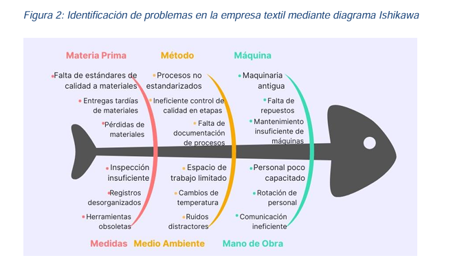
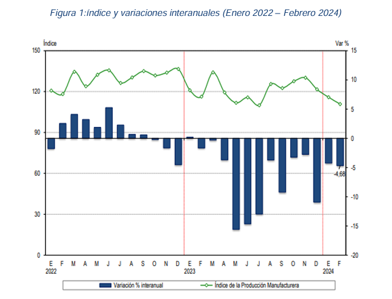
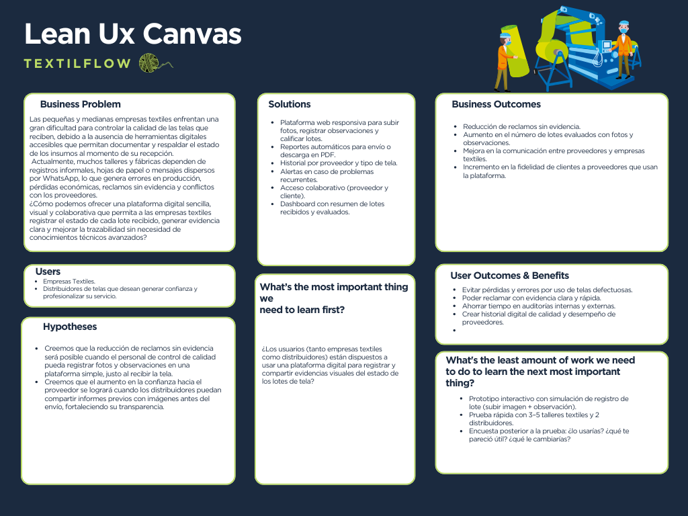
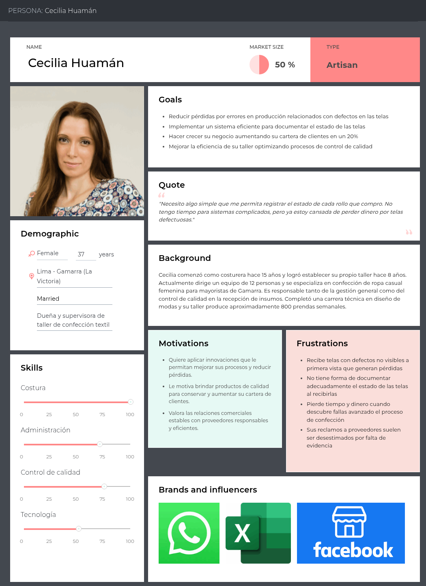
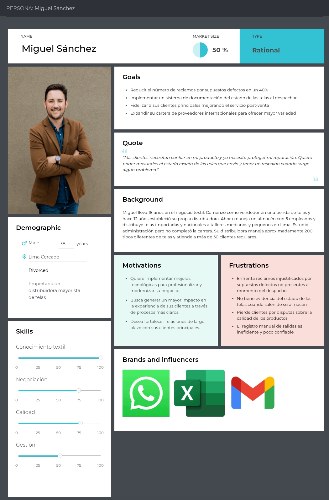
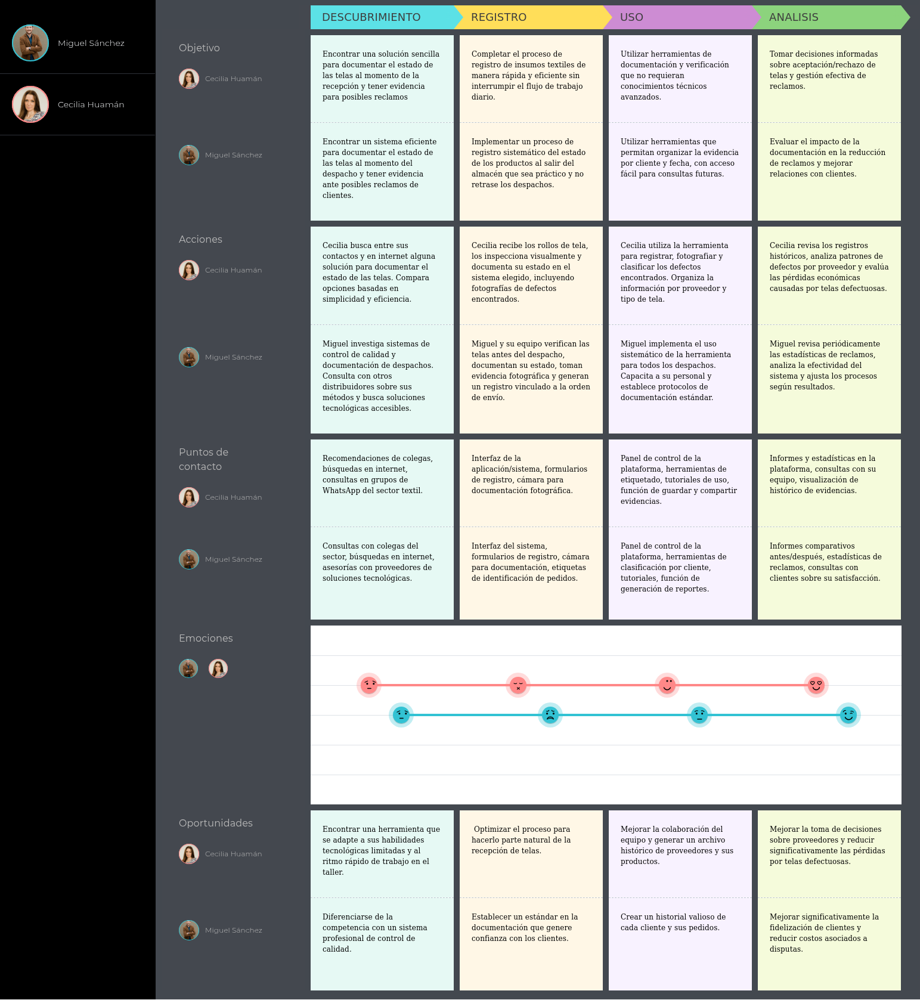
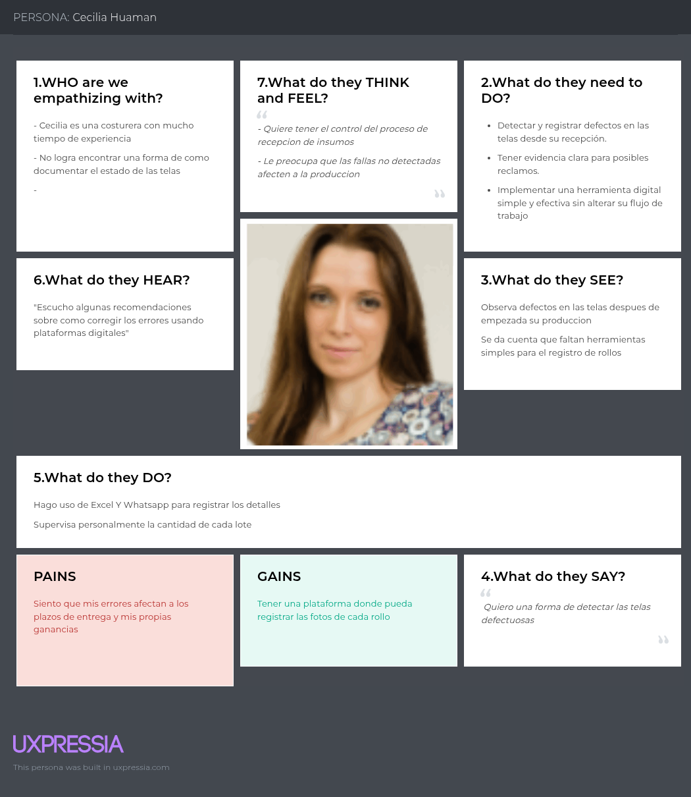
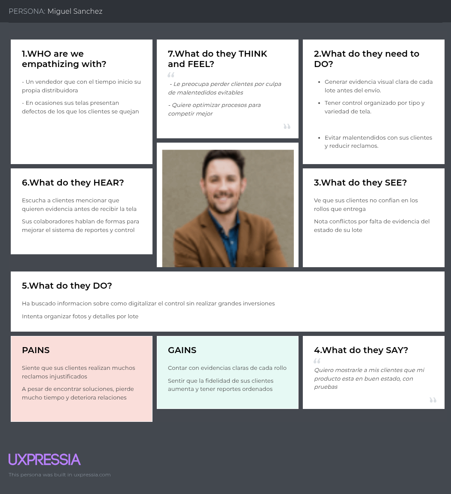

<p align="center">
  <strong>UNIVERSIDAD PERUANA DE CIENCIAS APLICADAS</strong>
</p>

<p align="center">
  
</p>

<p align="center">
  Ingeniería de Software <br>
  Periodo 202610 <br>
  SI0732 | Diseño de Experimentos de Ingeniería de Software <br>
  NRC: 12289 <br>  
  Profesor: Flores Moroco, Juan Antonio<br>
  Informe de TP1<br>
  Startup: Qualyx <br>
  Producto: TextilFlow
</p>

<br>

<p align="center"><strong>Relación de integrantes:</strong></p>

<table align="center">
  <thead>
    <tr>
      <th>Integrante</th>
      <th>Código</th>
    </tr>
  </thead>
  <tbody>
    <tr>
      <td>Mathias Eduardo Bueno Perales</td>
      <td>U202313433</td>
    </tr>
    <tr>
      <td>Fabrizio Alberto Paredes Santos</td>
      <td>U202310914</td>
    </tr>
    <tr>
      <td>Giorgio Marzouk Awad Vargas</td>
      <td>U202324041</td>
    </tr>
        <tr>
      <td>Sebastian Rodriguez Macedo</td>
      <td>U202310199</td>
    </tr>
  </tbody>
</table>

<br><br>

<p align="center">
  <strong>Abril, 2026</strong> <br>
  <strong>URL del proyecto:</strong>
  <a href="https://github.com/G-0X-Diseno-de-Experimentos">
    https://github.com/G-0X-Diseno-de-Experimentos
  </a>
</p>

## Registro de Versiones del Informe

| Versión | Fecha      | Autor                         | Descripción                                                                  |
|---------|------------|-------------------------------|------------------------------------------------------------------------------|
| TP1     | 20/04/2026 | Paredes Santos, Fabrizio Alberto  | Desarrollo de la carátula, tabla de contenidos y estructura general del informe. |
| TP1     | 21/04/2026 | Paredes Santos, Fabrizio Alberto | Desarrollo del Capítulo I, II, III organización de la estructura del informe y elaboración de las referencias bibliográficas. |
|     |  |   |             |
|     |  |   
  |    |


## Project Report Collaboration Insights

| URL del repositorio del reporte |
| :-----------------------------------: |
| [https://github.com/G-0X-Diseno-de-Experimentos/Docs](https://github.com/G-0X-Diseno-de-Experimentos/Docs) |

**TP1:**

Para la elaboración de la entrega TP1 de este informe, el equipo se organizó mediante reuniones de coordinación a través de un canal de Discord. En estas reuniones se definió la distribución de actividades, se asignaron responsables por capítulo y se establecieron fechas de revisión periódica para asegurar el avance progresivo de cada integrante.

| Integrante | Usuario Github | Detalle de avance |
|------------|----------------|-------------------|
| Fabrizio Alberto Paredes Santos | `psfa29` | Desarrollo del Capítulo I, II, III. |
| Mathias Eduardo Bueno Perales | `MathiasBueno` | |
| | `Shiftinnnnn` |  |
|  | `GiorgioAwad` |  |
| | `Khafna09` |  |

**Report Repository Insights:** 

En esta sección se presentan los analíticos de colaboración y los commits realizados en GitHub por los miembros del equipo dentro del repositorio del informe durante la fase AV1. Esta evidencia permite visualizar la participación de los integrantes y la evolución del trabajo colaborativo a lo largo del desarrollo del reporte.

- Report Contributors:
![Report Contributors] **FALTA IMAGEN**

- Report Network:
![Report Network] **FALTA IMAGEN**


## Contenido

### Tabla de contenidos

- [Contenido](#contenido)
- [Tabla de contenidos](#tabla-de-contenidos)
- [Student Outcome](#student-outcome)
- [Part I: As-Is Software Project](#part-i-as-is-software-project)

- [Capítulo I: Introducción](#capítulo-i-introducción)
  - [1.1. Startup Profile](#11-startup-profile)
    - [1.1.1. Descripción de la Startup](#111-descripción-de-la-startup)
    - [1.1.2. Perfiles de integrantes del equipo](#112-perfiles-de-integrantes-del-equipo)
  - [1.2. Solution Profile](#12-solution-profile)
    - [1.2.1. Antecedentes y problemática](#121-antecedentes-y-problemática)
    - [1.2.2. Lean UX Process.](#122-lean-ux-process)
      - [1.2.2.1. Lean UX Problem Statements.](#1221-lean-ux-problem-statements)
      - [1.2.2.2. Lean UX Assumptions.](#1222-lean-ux-assumptions)
      - [1.2.2.3. Lean UX Hypothesis Statements.](#1223-lean-ux-hypothesis-statements)
      - [1.2.2.4. Lean UX Canvas.](#1224-lean-ux-canvas)
  - [1.3. Segmentos objetivo.](#13-segmentos-objetivo)

- [Capítulo II: Requirements Elicitation & Analysis](#capítulo-ii-requirements-elicitation--analysis)
  - [2.1. Competidores.](#21-competidores)
    - [2.1.1. Análisis competitivo.](#211-análisis-competitivo)
    - [2.1.2. Estrategias y tácticas frente a competidores.](#212-estrategias-y-tácticas-frente-a-competidores)
  - [2.2. Entrevistas.](#22-entrevistas)
    - [2.2.1. Diseño de entrevistas.](#221-diseño-de-entrevistas)
    - [2.2.2. Registro de entrevistas.](#222-registro-de-entrevistas)
    - [2.2.3. Análisis de entrevistas.](#223-análisis-de-entrevistas)
  - [2.3. Needfinding.](#23-needfinding)
    - [2.3.1. User Personas.](#231-user-personas)
    - [2.3.2. User Task Matrix.](#232-user-task-matrix)
    - [2.3.3. User Journey Mapping.](#233-user-journey-mapping)
    - [2.3.4. Empathy Mapping.](#234-empathy-mapping)
    - [2.3.5. As-is Scenario Mapping.](#235-as-is-scenario-mapping)
  - [2.4. Ubiquitous Language.](#24-ubiquitous-language)

- [Capítulo III: Requirements Specification](#capítulo-iii-requirements-specification)
  - [3.1. To-Be Scenario Mapping.](#31-to-be-scenario-mapping)
  - [3.2. User Stories.](#32-user-stories)
  - [3.3. Product Backlog.](#33-product-backlog)
  - [3.4. Impact Mapping.](#34-impact-mapping)

- [Capítulo IV: Product Design](#capítulo-iv-product-design)
  - [4.1. Style Guidelines.](#41-style-guidelines)
    - [4.1.1. General Style Guidelines.](#411-general-style-guidelines)
    - [4.1.2. Web Style Guidelines.](#412-web-style-guidelines)
    - [4.1.3. Mobile Style Guidelines.](#413-mobile-style-guidelines)
      - [4.1.3.1. iOS Mobile Style Guidelines.](#4131-ios-mobile-style-guidelines)
      - [4.1.3.2. Android Mobile Style Guidelines.](#4132-android-mobile-style-guidelines)

  - [4.2. Information Architecture.](#42-information-architecture)
    - [4.2.1. Organization Systems.](#421-organization-systems)
    - [4.2.2. Labeling Systems.](#422-labeling-systems)
    - [4.2.3. SEO Tags and Meta Tags](#423-seo-tags-and-meta-tags)
    - [4.2.4. Searching Systems.](#424-searching-systems)
    - [4.2.5. Navigation Systems.](#425-navigation-systems)

  - [4.3. Landing Page UI Design.](#43-landing-page-ui-design)
    - [4.3.1. Landing Page Wireframe.](#431-landing-page-wireframe)
    - [4.3.2. Landing Page Mock-up.](#432-landing-page-mock-up)

  - [4.4. Mobile Applications UX/UI Design.](#44-mobile-applications-uxui-design)
    - [4.4.1. Mobile Applications Wireframes.](#441-mobile-applications-wireframes)
    - [4.4.2. Mobile Applications Wireflow Diagrams.](#442-mobile-applications-wireflow-diagrams)
    - [4.4.3. Mobile Applications Mock-ups.](#443-mobile-applications-mock-ups)
    - [4.4.4. Mobile Applications User Flow Diagrams.](#444-mobile-applications-user-flow-diagrams)

  - [4.5. Mobile Applications Prototyping.](#45-mobile-applications-prototyping)
    - [4.5.1. Android Mobile Applications Prototyping.](#451-android-mobile-applications-prototyping)
    - [4.5.2. iOS Mobile Applications Prototyping.](#452-ios-mobile-applications-prototyping)

  - [4.6. Web Applications UX/UI Design.](#46-web-applications-uxui-design)
    - [4.6.1. Web Applications Wireframes.](#461-web-applications-wireframes)
    - [4.6.2. Web Applications Wireflow Diagrams.](#462-web-applications-wireflow-diagrams)
    - [4.6.3. Web Applications Mock-ups.](#463-web-applications-mock-ups)
    - [4.6.4. Web Applications User Flow Diagrams.](#464-web-applications-user-flow-diagrams)

  - [4.7. Web Applications Prototyping.](#47-web-applications-prototyping)

  - [4.8. Domain-Driven Software Architecture.](#48-domain-driven-software-architecture)
    - [4.8.1. Software Architecture Context Diagram.](#481-software-architecture-context-diagram)
    - [4.8.2. Software Architecture Container Diagrams.](#482-software-architecture-container-diagrams)
    - [4.8.3. Software Architecture Components Diagrams.](#483-software-architecture-components-diagrams)

  - [4.9. Software Object-Oriented Design.](#49-software-object-oriented-design)
    - [4.9.1. Class Diagrams.](#491-class-diagrams)
    - [4.9.2. Class Dictionary.](#492-class-dictionary)

  - [4.10. Database Design.](#410-database-design)
    - [4.10.1. Relational/Non-Relational Database Diagram.](#4101-relationalnon-relational-database-diagram)

- [Capítulo V: Product Implementation](#capítulo-v-product-implementation)
  - [5.1. Software Configuration Management.](#51-software-configuration-management)
    - [5.1.1. Software Development Environment Configuration.](#511-software-development-environment-configuration)
    - [5.1.2. Source Code Management.](#512-source-code-management)
    - [5.1.3. Source Code Style Guide & Conventions.](#513-source-code-style-guide--conventions)
    - [5.1.4. Software Deployment Configuration.](#514-software-deployment-configuration)

  - [5.2. Product Implementation & Deployment.](#52-product-implementation--deployment)
    - [5.2.1. Sprint Backlogs.](#521-sprint-backlogs)
    - [5.2.2. Implemented Landing Page Evidence](#522-implemented-landing-page-evidence)
    - [5.2.3. Implemented Frontend-Web Application Evidence](#523-implemented-frontend-web-application-evidence)
    - [5.2.4. Acuerdo de Servicio - SaaS](#524-acuerdo-de-servicio---saas)
    - [5.2.5. Implemented Native-Mobile Application Evidence](#525-implemented-native-mobile-application-evidence)
    - [5.2.6. Implemented RESTful API and/or Serverless Backend Evidence](#526-implemented-restful-api-andor-serverless-backend-evidence)
    - [5.2.7. RESTful API documentation](#527-restful-api-documentation)
    - [5.2.8. Team Collaboration Insights](#528-team-collaboration-insights)

  - [5.3. Video About-the-Product.](#53-video-about-the-product)

- [Part II: Verification, Validation & Pipeline](#part-ii-verification-validation--pipeline)

- [Capítulo VI: Product Verification & Validation](#capítulo-vi-product-verification--validation)
  - [6.1. Testing Suites & Validation](#61-testing-suites--validation)
    - [6.1.1. Core Entities Unit Tests.](#611-core-entities-unit-tests)
    - [6.1.2. Core Integration Tests.](#612-core-integration-tests)
    - [6.1.3. Core Behavior-Driven Development](#613-core-behavior-driven-development)
    - [6.1.4. Core System Tests.](#614-core-system-tests)

  - [6.2. Static testing & Verification](#62-static-testing--verification)
    - [6.2.1. Static Code Analysis](#621-static-code-analysis)
      - [6.2.1.1. Coding standard & Code conventions.](#6211-coding-standard--code-conventions)
      - [6.2.1.2. Code Quality & Code Security.](#6212-code-quality--code-security)
    - [6.2.2. Reviews](#622-reviews)

  - [6.3. Validation Interviews.](#63-validation-interviews)
    - [6.3.1. Diseño de Entrevistas.](#631-diseño-de-entrevistas)
    - [6.3.2. Registro de Entrevistas.](#632-registro-de-entrevistas)
    - [6.3.3. Evaluaciones según heurísticas.](#633-evaluaciones-según-heurísticas)

  - [6.4. Auditoría de Experiencias de Usuario](#64-auditoría-de-experiencias-de-usuario)
    - [6.4.1. Auditoría realizada.](#641-auditoría-realizada)
      - [6.4.1.1. Información del grupo auditado.](#6411-información-del-grupo-auditado)
      - [6.4.1.2. Cronograma de auditoría realizada.](#6412-cronograma-de-auditoría-realizada)
      - [6.4.1.3. Contenido de auditoría realizada.](#6413-contenido-de-auditoría-realizada)

    - [6.4.2. Auditoría recibida.](#642-auditoría-recibida)
      - [6.4.2.1. Información del grupo auditor.](#6421-información-del-grupo-auditor)
      - [6.4.2.2. Cronograma de auditoría recibida.](#6422-cronograma-de-auditoría-recibida)
      - [6.4.2.3. Contenido de auditoría recibida.](#6423-contenido-de-auditoría-recibida)
      - [6.4.2.4. Resumen de modificaciones para subsanar hallazgos.](#6424-resumen-de-modificaciones-para-subsanar-hallazgos)

- [Capítulo VII: DevOps Practices](#capítulo-vii-devops-practices)
  - [7.1. Continuous Integration](#71-continuous-integration)
    - [7.1.1. Tools and Practices.](#711-tools-and-practices)
    - [7.1.2. Build & Test Suite Pipeline Components.](#712-build--test-suite-pipeline-components)

  - [7.2. Continuous Delivery](#72-continuous-delivery)
    - [7.2.1. Tools and Practices.](#721-tools-and-practices)
    - [7.2.2. Stages Deployment Pipeline Components.](#722-stages-deployment-pipeline-components)

  - [7.3. Continuous deployment](#73-continuous-deployment)
    - [7.3.1. Tools and Practices.](#731-tools-and-practices)
    - [7.3.2. Production Deployment Pipeline Components.](#732-production-deployment-pipeline-components)

  - [7.4. Continuous Monitoring](#74-continuous-monitoring)
    - [7.4.1. Tools and Practices](#741-tools-and-practices)
    - [7.4.2. Monitoring Pipeline Components](#742-monitoring-pipeline-components)
    - [7.4.3. Alerting Pipeline Components](#743-alerting-pipeline-components)
    - [7.4.4. Notification Pipeline Components.](#744-notification-pipeline-components)


## Student Outcome

### ABET – EAC - Student Outcome 4

**Criterio:** La capacidad de reconocer responsabilidades éticas y profesionales en situaciones de ingeniería y hacer juicios informados, que deben considerar el impacto de las soluciones de ingeniería en contextos globales, económicos, ambientales y sociales.


| Criterio específico | Acciones realizadas | Conclusiones |
|----------------------|---------------------|--------------|
| La capacidad de reconocer responsabilidades éticas y profesionales en situaciones de ingeniería y hacer juicios informados, que deben considerar el impacto de las soluciones de ingeniería en contextos globales, económicos, ambientales y sociales. | **TP1**<br><br> Bueno Perales, Mathias Eduardo:  <br><br>  <br><br> Paredes Santos, Fabrizio Alberto:  <br><br>  |


## Capítulo I: Introducción

### 1.1. Startup Profile

#### 1.1.1. Descripción de la Startup

Qualyx es una startup tecnológica orientada al desarrollo de soluciones digitales que optimizan la gestión operativa de las empresas del sector textil. Esta iniciativa surge como respuesta a la necesidad de digitalizar y transparentar los procesos relacionados con la recepción, evaluación y trazabilidad de los insumos textiles, aspectos fundamentales para asegurar la calidad en la producción de prendas y productos confeccionados.

La startup fue fundada por estudiantes de Ingeniería de Software de la Universidad Peruana de Ciencias Aplicadas (UPC) y tiene como propósito brindar herramientas tecnológicas accesibles y colaborativas que permitan mejorar el control de calidad y reducir pérdidas dentro de la cadena de suministro textil.

Visión

Ser la plataforma open source líder en trazabilidad y control de calidad textil en América Latina, impulsando relaciones comerciales más justas, transparentes y eficientes dentro del ecosistema productivo.

Misión

Proporcionar a distribuidores, talleres y empresas textiles una herramienta digital integral y colaborativa que permita verificar, documentar y respaldar la calidad de los insumos textiles, fortaleciendo la confianza en la cadena de suministro y reduciendo errores en los procesos de producción.

#### 1.1.2. Perfiles de integrantes del equipo

| Foto | Miembros del equipo | Código de Estudiante | Descripción |
| :---: | :--- | :--- | :--- |
| | Mathias Bueno Perales  | u202313433 |Soy una persona optimista y responsable al cumplir mis labores para-con el grupo. Tengo experiencia respecto a proyectos previamente hechos en la rama de Ingenieria de Software y conocimientos en programacion como en HTML y CSS. Siempre procuro lo mejor para el equipo y ayudar en todo lo que este en mi alcance. |
| | Paredes Santos, Fabrizio Alberto | U202310914 | Profesional en formación con experiencia en desarrollo de aplicaciones web y móviles utilizando stacks modernos como Vue.js y .NET, Angular y Spring Boot, además de desarrollo móvil con Flutter y Kotlin. También he trabajado en la creación de páginas web con React, Next.js y Tailwind CSS, enfocadas en rendimiento y experiencia de usuario. Me caracterizo por ser proactivo, responsable y orientado a resultados, con capacidad para adaptarme a entornos dinámicos y contribuir eficazmente en equipos de desarrollo. |
|![alt text] *FOTO* | Rodriguez Macedo, Sebastian | U202310199 | Soy una persona capaz de resolver problemas con el equipo desde un punto de vista diferente, además ofrezco siempre compromiso hacia mis compañeros cumpliendo con las asignaciones de manera responsable. |

### 1.2. Solution Profile

### 1.2.1. Antecedentes y problemática

**What:** En el sector textil peruano, especialmente en las pequeñas y medianas empresas, los procesos de recepción de tela y control de calidad aún se realizan de forma manual, lo cual genera una alta tasa de errores e incidencias en la producción. La falta de herramientas digitales para registrar y validar las características técnicas de los insumos impide una trazabilidad efectiva del material, dificultando los reclamos a los proveedores ante posibles defectos (Astete & Domínguez, 2023).

*Figura 1: Identificación de problemas en la empresa textil mediante diagrama Ishikawa*

<p align="center">
  
</p>

**When:** Este problema ocurre cada vez que una empresa recibe un lote de tela. Si durante este momento crítico no se realiza una evaluación detallada o esta se ejecuta de manera informal, existe el riesgo de utilizar insumos defectuosos en la producción. Como consecuencia, se generan reprocesos, pérdidas económicas y retrasos en la entrega de productos terminados. Además, la falta de estandarización en los procesos ocasiona inconsistencias que afectan directamente la calidad final del producto (Serna, 2024).

**Where:** El problema se presenta principalmente en las áreas de recepción de materiales y almacenes textiles, espacios caracterizados por una alta rotación de insumos y, en muchos casos, por un acceso limitado a herramientas tecnológicas. La ausencia de soluciones digitales adaptadas a estas condiciones provoca registros incompletos o inexistentes sobre el estado y calidad de los lotes de tela recibidos (Astete & Domínguez, 2023).

**Who:** Las personas más afectadas por esta situación son las encargadas de almacén, las jefas de producción y las operarias de control de calidad. Estas deben evaluar características como color, textura o elasticidad sin contar con herramientas adecuadas para registrar evidencias técnicas. Esto dificulta la realización de reclamos sustentados frente a los proveedores. Asimismo, las distribuidoras textiles también se ven perjudicadas debido a conflictos relacionados con devoluciones no documentadas (Aspilcueta, 1999).

**Why:** Una de las principales causas es el bajo nivel de digitalización del sector textil. Aunque algunas empresas han iniciado procesos de modernización, menos del 45% del sector ha implementado herramientas digitales en sus operaciones (Astete & Domínguez, 2023, p. 4). Además, muchas micro y pequeñas empresas no cuentan con el presupuesto ni la capacitación necesaria para adoptar soluciones tecnológicas, quedando rezagadas frente a los procesos de transformación digital propios de la industria 4.0 (Aspilcueta, 1999).

**How:** Las empresas textiles que buscan optimizar la gestión de sus insumos utilizarán la solución en entornos operativos dinámicos, principalmente mediante tablets o dispositivos móviles. Por ello, la interfaz debe ser intuitiva, accesible y permitir registrar evidencia como fotografías, comentarios y etiquetas de forma rápida y sencilla. Estudios previos demuestran que metodologías como las 5S y el ciclo PDCA contribuyen significativamente a mejorar el orden operativo y reducir defectos de producción hasta en un 80% (Serna, 2024).

**How Much:** Los costos asociados a no resolver esta problemática son elevados. Los defectos no detectados oportunamente generan reprocesos que pueden representar pérdidas equivalentes al 52.6% del total de la producción (Serna, 2024). Asimismo, la falta de evidencia técnica ocasiona conflictos constantes con proveedores y limita la capacidad de las Mypes para integrarse a procesos de transformación digital adaptados a sus necesidades reales (Astete & Domínguez, 2023, p. 6).

*Figura 2: Índice y variaciones interanuales*
<p align="center">
  
</p>


#### 1.2.2. Lean UX Process

El Lean UX Process es un enfoque ágil centrado en el usuario que permite validar de manera iterativa las decisiones de diseño mediante la formulación de hipótesis y la experimentación continua. Este enfoque se basa en el ciclo construir–medir–aprender, permitiendo al equipo reducir la incertidumbre y asegurar que la solución propuesta responda a necesidades reales del usuario.

##### 1.2.2.1. Lean UX Problem Statements

**Domain**

Gestión de control de calidad y trazabilidad de insumos en el sector textil peruano.

**Customer Segments**

Empresas textiles pequeñas y medianas.

Distribuidores y proveedores de tela.

**Problem / Pain Points**

Se ha identificado que las empresas textiles presentan dificultades para realizar un control adecuado de los lotes de tela que reciben de sus proveedores, lo que genera:

\-Uso de insumos defectuosos en producción.

\-Falta de evidencia para realizar reclamos.

\-Pérdidas económicas por reprocesos.

\-Registros manuales desorganizados.

\-Conflictos entre distribuidores y clientes.

\-Baja trazabilidad del material textil.

Además, muchas empresas aún dependen de herramientas informales como papel, WhatsApp o Excel para registrar incidencias, lo que limita la transparencia y eficiencia del proceso.

**Gap**

Existe una brecha entre los procesos manuales e informales actualmente utilizados para el control de calidad textil y la necesidad de contar con una solución digital colaborativa que permita registrar, documentar y compartir información confiable sobre el estado de los lotes de tela.

**Vision / Strategy**

Desarrollar una plataforma digital llamada TextilFlow que permita centralizar el registro visual y documental de los lotes textiles, facilitando la trazabilidad, reduciendo errores en producción y fortaleciendo la relación comercial entre empresas textiles y distribuidores.

**Initial Segment**

Pequeñas y medianas empresas textiles de Lima Metropolitana que requieren mejorar el control de calidad y trazabilidad de los insumos textiles que reciben de distintos proveedores.

**¿Cómo podríamos mejorar el proceso de control de calidad y trazabilidad de telas en las empresas textiles mediante una plataforma digital colaborativa que permita registrar evidencias, reducir errores de producción y fortalecer la transparencia entre proveedores y clientes?**

#### 1.2.2.2. Lean UX Assumptions

Las siguientes suposiciones han sido definidas en base al entendimiento preliminar del dominio del problema y serán validadas mediante un proceso iterativo centrado en el usuario.

**Business Assumptions**

- Se asume que las empresas textiles necesitan mejorar sus procesos de control de calidad para reducir pérdidas económicas y reprocesos.
- Se asume que existe una creciente necesidad de digitalización en el sector textil peruano.
- Se asume que una plataforma colaborativa puede fortalecer la relación entre proveedores y clientes textiles.
- Se asume que las empresas percibirán valor en contar con evidencia visual y documental de cada lote recibido.
- Se asume que la trazabilidad digital puede reducir conflictos relacionados con devoluciones y reclamos.
- Se asume que las Mypes textiles estarían dispuestas a adoptar soluciones accesibles y fáciles de usar.
- Se asume que un modelo freemium y de suscripción mensual puede ser sostenible para la plataforma.
- Se asume que el mercado textil presenta oportunidades para soluciones especializadas y enfocadas en procesos específicos del rubro.

**User Assumptions**

*Empresas textiles*

- Se asume que los responsables de almacén y control de calidad necesitan herramientas rápidas y simples para registrar información de los lotes textiles.
- Se asume que los usuarios valoran la posibilidad de registrar fotografías, comentarios y observaciones técnicas desde dispositivos móviles.
- Se asume que las empresas desean reducir el uso de registros manuales y procesos informales.
- Se asume que los usuarios utilizarán la plataforma durante el proceso de recepción de telas.

*Distribuidores de tela*

- Se asume que los distribuidores necesitan respaldar el estado de la tela antes del envío para evitar conflictos posteriores.
- Se asume que los distribuidores consideran importante mantener un historial de entregas y evidencia visual de los lotes.
- Se asume que una herramienta colaborativa puede mejorar la confianza comercial con sus clientes.

#### 1.2.2.3. Lean UX Hypothesis Statements

**Creemos que** permitir a las empresas textiles registrar fotografías y observaciones técnicas sobre los lotes de tela antes de utilizarlos reducirá los errores en producción y facilitará la realización de reclamos con evidencia. **Sabremos que esto es cierto** cuando al menos el 70% de los usuarios registren activamente los lotes en la plataforma y reporten una disminución de incidencias relacionadas con telas defectuosas.

**Creemos que** brindar a los distribuidores una herramienta para documentar el estado de los lotes antes del envío aumentará la transparencia y reducirá los conflictos con los clientes. **Sabremos que esto es cierto** cuando los distribuidores generen reportes previos al despacho y los clientes indiquen una mayor confianza en la recepción de materiales.

**Creemos que** una interfaz simple, visual y accesible desde celulares o tablets facilitará la adopción de la plataforma en entornos operativos textiles. **Sabremos que esto es cierto** cuando al menos el 65% de los usuarios continúe utilizando la plataforma después de las primeras semanas de uso y la tasa de abandono inicial sea menor al 30%.

**Creemos que** centralizar la información histórica de los lotes permitirá a las empresas textiles y distribuidores mejorar la trazabilidad y optimizar la toma de decisiones relacionadas con proveedores e insumos. **Sabremos que esto es cierto** cuando los usuarios consulten frecuentemente el historial de lotes y reporten mejoras en el seguimiento de incidencias y auditorías internas.

#### 1.2.2.4. Lean UX Canvas

*Figura 2: Lean Ux Canvas de TextilFlow*

<p align="center">
  
</p>


## 1.3. Segmentos objetivo

**Segmento Objetivo 1: Empresas textiles (Talleres y fábricas de confección)**

Este segmento está conformado por pequeñas y medianas empresas textiles dedicadas a la confección de prendas, las cuales requieren gestionar adecuadamente la recepción y control de calidad de los insumos textiles antes de iniciar la producción. Los principales usuarios dentro de este segmento son responsables de producción, encargados de almacén y personal de control de calidad. En muchos casos, estas funciones son realizadas por las propias dueñas del taller o personal multitarea.

 **Características demográficas**

- **Ubicación:** Lima Metropolitana, especialmente en zonas de alta actividad textil como Gamarra (La Victoria), San Juan de Lurigancho, El Agustino y Los Olivos.
- **Edad:** Entre 25 y 45 años, con una media aproximada de 35 años.
- **Nivel socioeconómico:** Clase media y media-baja.
- **Tipo de empresa:** Micro y pequeñas empresas textiles dedicadas a confección y producción de prendas.

**Información estadística de sustento**

El sector textil y de confecciones en el Perú está conformado principalmente por micro y pequeñas empresas, las cuales representan una parte importante de la actividad manufacturera nacional. Muchas de estas organizaciones aún presentan bajos niveles de digitalización y continúan utilizando procesos manuales para la gestión operativa y control de calidad de sus insumos textiles (Instituto Nacional de Estadística e Informática \[INEI\], 2018).

**Problemática del segmento**

- No cuentan con sistemas formales para registrar el estado de las telas recibidas.
- Presentan errores frecuentes en producción debido al uso de materiales defectuosos.
- Tienen dificultades para generar evidencia técnica que respalde reclamos hacia proveedores.
- Utilizan registros manuales, hojas físicas o mensajes de WhatsApp, generando desorganización y pérdida de información.

**Segmento Objetivo 2: Distribuidores de telas (Mayoristas, tiendas o proveedores directos)**

Este segmento está compuesto por empresas y comerciantes dedicados a la venta y distribución de telas hacia talleres, fábricas textiles y diseñadores independientes. Muchos operan desde tiendas físicas o almacenes y realizan despachos directos a sus clientes.

**Características demográficas**

- **Ubicación:** Zonas comerciales textiles como Gamarra (La Victoria), Lima Cercado, Callao, Ate y San Luis.
- **Edad:** Entre 30 y 55 años, con una media aproximada de 42 años.
- **Nivel socioeconómico:** Clase media.
- **Tipo de negocio:** Distribuidoras, mayoristas y proveedores textiles.

**Información estadística de sustento**

El comercio textil en Lima Metropolitana concentra una gran parte de la cadena de suministro del sector confecciones, especialmente en zonas comerciales como Gamarra, considerado uno de los principales emporios textiles de América Latina. Este ecosistema agrupa miles de negocios dedicados a la distribución y comercialización de telas y prendas, evidenciando la necesidad de herramientas digitales que permitan mejorar la trazabilidad y gestión de los lotes textiles (TV Perú, 2024).

**Problemática del segmento**

- No poseen mecanismos formales para registrar el estado de los lotes antes del despacho.
- Enfrentan reclamos relacionados con defectos no documentados.
- Carecen de respaldo visual e histórico para demostrar la calidad del material entregado.
- Tienen dificultades para gestionar incidencias y fortalecer la confianza comercial con sus clientes.


## Capítulo II: Requirements & Analysis

### 2.1. Competidores

Este análisis competitivo evalúa a Textiflow frente a otros actores del mercado, con el fin de identificar estrategias que permitan a Qualix consolidarse en el sector peruano y latinoamericano.

|                           |  |  |  |  |
|---------------------------|------------|--------------|--------------|--------------|
| **Competitive Analysis Landscape**       |     ¿Por qué llevar a cabo este análisis? | El propósito de este análisis competitivo es evaluar las ventajas y desventajas de Qualix y su producto Textiflow en comparación con los competidores, con el fin de crear estrategias y diseños que nos permitan competir de manera efectiva en el mercado.                  |
| **Perfil**                |    Textiflow       |     Inspectorio        |   Famileo           |       TextileGenesis       |
| Overview                  |  Plataforma web para trazabilidad y control de calidad en la recepción y distribución de telas | Plataforma SaaS global para control de calidad, auditorías y cumplimiento en la cadena de suministro | Plataforma de gestión de calidad, cumplimiento y especificaciones para textiles y productos blandos. |  Plataforma de trazabilidad para el sector textil/moda, que utiliza la tecnología Fibercoin |
| Ventaja competitiva <br> ¿Qué valor ofrece a los clientes? | Textiflow se enfoca en utilizar evidencia visual y documentada del estado de los lotes de tela para prevenir errores y fortalecer la confianza entre distribuidores y talleres | Inspectorio su gran enfoque es en automatizar inspecciones, mejora cumplimiento y visibilidad, reduce errores humanos | Texbase se enfoca en unificar la cadena de suministro en términos de cumplimiento, pruebas de laboratorio y gestión de producto  | TextileGenesis se concentra más en acelerar la implantación de la trazabilidad desde la fibra al retail para todo el sector  |
| **Perfil de Marketing**   |            |              |              |              |
| Mercado objetivo          |TextiFlow tiene como mercado objetivo empresas textiles, talleres de confección y distribuidores de telas en Perú dándole una mayor visualización a las pequeñas empresas y negocios que recién comienzan en este rubro    |  Inspectorio está dirigido principalmente a grandes marcas de moda, retailers y fabricantes globales  |  Textbase está más dirigido hacia grandes retailers, marcas y además a laboratorios textiles  | TextileGenesis está más enfocado a lo que es una red global de fabricantes de fibras sostenibles, marcas líderes y organizaciones industriales |
| Estrategias de marketing  |  Las estrategias de marketing que utiliza el producto TextiFlow se centran en promover su solución dentro de los estándares modernos como: Marketing de Contenidos Marketing en Redes Sociales Publicidad Online Publicidad directa en zona de distribución textil     |   Inspectorio opta por un estilo de marketing como: B2B, alianzas con marcas como Target, Crocs, Levi’s      |   Textbase se enfoca más por el lado de asociaciarce con proveedores certificados, énfasis en estándares    |   TextileGenesis busca más por optar una comunicación directa con los retails además de darse a conocer por anuncios en línea        |
| **Perfil de Producto**    |            |              |              |              |
| Productos & Servicios     | TextilFlow ofrece en principal registrar lotes de tela, generar reportes, subir fotos, evidencias y compartir datos con clientes/proveedores; dándole un completo énfasis en la verificación de las telas |  Inspectorio ofrece en general las inspecciones digitales, compliance, trazabilidad, auditorías, desbordas analíticos   |  Textbase se enfoca más en ofrecer una gestión de pruebas, fichas técnicas, cumplimiento regulatorio, calidad   |  TextileGenesis ofrece más que todo acelerar la implantación de la trazabilidad desde la fibra al retail con marcas internacionales de renombre   |
| Precios & Costos          |  Ofrecemos una versión de pago accesible para los clientes     |  Ofrece más que todo modelo Enterprise personalizado, alto ticket      | Enfocado a medianas y grandes empresas, con precios personalizados   |   Posiblemente basado en membresía o suscripción con opción a free service     |
| Canales de distribución <br> (Web y/o Móvil) | Directo vía web, App móvil (Android) y ferias textiles | Equipo comercial, partners globales, eventos corporativos | Ventas corporativas, red de partners tecnológicos | Alianzas estratégicas y presencia digital |
| **Análisis SWOT**         |            |              |              |              |
| Fortalezas                | Enfoque regional, facilidad de uso, precio accesible, visión open source. Adaptabilidad a procesos locales y facilidad de implementación   | - Cliente base fuerte, herramienta robusta, presencia global   | Larga trayectoria en la industria, alta personalización    | Foco en sostenibilidad y trazabilidad desde la fibra al retail      |
| Debilidades               | Startup en etapa temprana, sin clientes consolidados aún. Baja adopción tecnológica de usuarios tradicionales del rubro textil     |  Costo elevado, poco enfoque en pymes    | No enfocado en control visual de lotes o contacto directo con talleres   | No especificado, pero podría carecer de enfoque en pymes   |
| Oportunidades             |  Digitalización acelerada del sector textil, necesidad de transparencia en Perú. Nuevas exigencias de trazabilidad y respaldo para exportaciones y auditorías   |  Expansión hacia LATAM   |  Integrarse con plataformas emergentes más ágiles   | Reposicionar modelo en regiones donde el impacto de ESG es creciente     |
| Amenazas                  |   Competidores consolidados en mercados internacionales que pueden expandirse localmente. Cultura de informalidad o resistencia al cambio en pymes textiles  |   Competencia más flexible o económica para mercados emergentes    | Soluciones más económicas y específicas para LATAM    |  Demanda baja en mercados donde la trazabilidad aún no es prioridad    |


#### 2.1.2. Estrategias y tácticas frente a competidores

A partir del análisis competitivo realizado, se identificaron las principales fortalezas, debilidades, oportunidades y amenazas presentes en el mercado de soluciones digitales orientadas al sector textil. Esta información permite definir estrategias y tácticas preliminares que ayudarán a TextilFlow a diferenciarse, aprovechar oportunidades del entorno y afrontar las condiciones competitivas del mercado.

**Estrategias frente a las fortalezas de los competidores**

Los competidores actuales cuentan con plataformas robustas, presencia internacional e integración con sistemas empresariales avanzados como ERP y herramientas de automatización. Además, muchas de estas soluciones abarcan múltiples procesos de la cadena textil y están orientadas a grandes empresas del sector.

Frente a ello, TextilFlow buscará diferenciarse mediante una propuesta enfocada específicamente en la trazabilidad visual y documental de lotes textiles, adaptada a la realidad operativa de talleres, fábricas y distribuidores peruanos.

**Estrategias**

\-Ofrecer una solución especializada y accesible para pequeñas y medianas empresas textiles.

\-Priorizar la simplicidad y facilidad de uso frente a plataformas complejas.

\-Enfocar el producto en la gestión visual y colaborativa del control de calidad.

**Tácticas**

\-Implementar registro de fotografías, comentarios técnicos y generación automática de reportes.

\-Diseñar interfaces intuitivas adaptadas a usuarios sin experiencia tecnológica.

\-Permitir el acceso desde dispositivos móviles utilizados en almacenes y áreas operativas.

\-Incorporar historiales de lotes y evidencia digital para facilitar auditorías y reclamos.

**Estrategias frente a las debilidades de los competidores**

Muchas soluciones existentes presentan altos costos de implementación, requieren capacitación especializada y están orientadas principalmente a grandes empresas, dejando de lado a las Mypes textiles y distribuidores locales.

TextilFlow aprovechará esta situación ofreciendo una plataforma ligera, flexible y enfocada en las necesidades reales del mercado peruano.

**Estrategias**

\-Mantener un modelo de desarrollo iterativo basado en feedback continuo de los usuarios.

\-Facilitar el acceso a la digitalización mediante una solución económica y adaptable.

**Tácticas**

\-Implementar modelos freemium y planes accesibles para talleres y distribuidores pequeños.

\-Desarrollar formularios simples y procesos rápidos de registro de información.

\-Brindar soporte técnico y canales de contacto integrados dentro de la plataforma.

\-Publicar mejoras frecuentes basadas en problemas reales identificados por los usuarios.

**Estrategias frente a las oportunidades del mercado**

El sector textil peruano atraviesa un proceso progresivo de digitalización y existe una creciente necesidad de mejorar la trazabilidad y control de calidad de los insumos textiles. Asimismo, aún existe poca oferta de herramientas especializadas para talleres y distribuidores pequeños.

TextilFlow aprovechará este contexto posicionándose como una solución enfocada en transparencia, control y respaldo documental dentro de la cadena textil.

**Estrategias**

\-Posicionar la plataforma como una herramienta especializada en control de calidad textil.

\-Aprovechar la necesidad de digitalización en talleres y distribuidoras textiles.

\-Impulsar el uso de evidencia digital como estándar operativo dentro del sector.

**Tácticas**

\-Realizar pruebas piloto con talleres textiles y distribuidores locales.

\-Incorporar plantillas preconfiguradas para distintos tipos de telas y defectos comunes.

\-Crear contenido educativo sobre trazabilidad, control de calidad y buenas prácticas textiles.

\-Participar en ferias, comunidades y eventos relacionados con el sector textil peruano.

**Estrategias frente a las amenazas del mercado**

Entre las principales amenazas se encuentran la aparición de nuevos competidores con mayor capacidad económica, el uso continuo de herramientas informales como Excel o WhatsApp y la baja adopción tecnológica presente en algunos sectores textiles.

Para afrontar estas amenazas, TextilFlow buscará demostrar valor práctico y tangible desde las primeras etapas de uso.

**Estrategias**

\-Posicionar a TextilFlow como una herramienta que reduce pérdidas económicas y mejora la confianza comercial.

\-Promover la adopción tecnológica mediante una experiencia simple y práctica.

**Tácticas**

\-Mostrar casos reales de reducción de errores y reclamos gracias al uso de evidencia digital.

\-Establecer alianzas con incubadoras, universidades y gremios textiles.

\-Difundir demostraciones visuales del funcionamiento de la plataforma.

\-Enfatizar el ahorro de tiempo y la reducción de reprocesos como beneficios principales del sistema.

### 2.2. Entrevistas

La sección abarca el proceso de investigación de nuestros segmentos objetivos mediante la recolección de información en base a entrevistas.

#### 2.2.1. Diseño de entrevistas

**Segmento Objetivo 1: Empresas textiles (Talleres y fábricas de confección)**

Las siguientes preguntas están dirigidas a responsables de producción, personal de control de calidad y encargados de recepción de insumos en talleres y fábricas textiles. El objetivo es comprender cómo gestionan actualmente la revisión y trazabilidad de los lotes de tela dentro de sus procesos operativos.

**Características demográficas**

1. ¿Cuál es tu edad?
2. ¿En qué ciudad y tipo de empresa textil trabajas (taller, fábrica, marca de ropa, etc.)?
3. ¿Cuántos años de experiencia tienes trabajando en el rubro textil?

**Preguntas principales**

1. ¿Cómo es el proceso actual cuando llega un nuevo lote de tela a tu empresa?
2. ¿Tienen un protocolo definido para revisar la calidad de la tela? ¿Quién lo realiza?
3. ¿Qué aspectos revisan normalmente en la tela (color, textura, elasticidad, manchas, etc.)?
4. ¿Llevan algún registro de esa revisión? ¿Cómo lo hacen? (Papel, Excel, WhatsApp, etc.)
5. ¿Toman fotos o videos como respaldo? ¿Dónde los guardan?
6. ¿Qué pasa si detectan un problema en el lote recibido? ¿Tienen forma de reclamar al proveedor? ¿Cómo lo hacen?
7. ¿Han tenido problemas por haber usado tela en mal estado sin darse cuenta al inicio?

**Preguntas sobre el proyecto(TextilFlow)**

1. ¿Qué te parecería tener una plataforma donde puedas registrar cada lote de tela que recibes y dejar evidencia visual y escrita de su estado?
2. ¿Qué datos crees que serían importantes registrar en la plataforma? (Ej. tipo de tela, proveedor, fecha, problemas detectados, fotos, etc.)
3. ¿Te ayudaría tener reportes automáticos o un historial con todos los lotes revisados?

**Segmento Objetivo 2: Distribuidores de telas (Mayoristas, tiendas o proveedores directos)**

Las siguientes preguntas están dirigidas a distribuidores y proveedores textiles con el objetivo de comprender cómo gestionan actualmente la verificación, documentación y entrega de lotes de tela hacia sus clientes.

**Características demográficas**

1. ¿Cuál es tu edad?
2. ¿En qué distrito o ciudad operas tu negocio?
3. ¿Tu negocio cuenta con tienda física, ventas online o ambos?
4. ¿Qué tipo de telas comercializas con mayor frecuencia?

**Preguntas principales**

1. ¿Cómo verificas la calidad de tus telas antes de enviarlas a los clientes?
2. ¿Tienes alguna forma de respaldar que las telas estaban en buen estado al momento de la entrega?
3. ¿Te han reclamado alguna vez por defectos que no detectaste? ¿Qué pasó?
4. ¿Llevas algún registro sobre los lotes que envías (número, tipo de tela, cliente)?
5. ¿Tomas fotos o haces alguna inspección antes de despachar?

**Preguntas sobre el proyecto(TextilFlow)**

1. ¿Qué te parecería tener una plataforma donde puedas dejar evidencia visual del estado de las telas antes del envío?
2. ¿Te ayudaría contar con un historial de envíos y controles realizados por cliente?
3. ¿Preferirías que los controles de calidad sean visibles para ambos (tú y tu cliente) dentro de la misma plataforma?

#### 2.2.2. Registro de entrevistas

**Segmento #1:**

**Entrevista 1**

|Entrevistado 1 |  |
| :------------- | :------------------------------------------------------------ |
| Edad |  |
| Distrito/Ciudad |  |
| Imagen | <p align="center"></p> |
| Resumen |  |
| Duración |  |

**Entrevista 2**
**FALTA**

**Entrevista 3**

**FALTA**

**Segmento #2**

**Entrevista 4**

**FALTA**

**Entrevista 5**

**FALTA**

**Entrevista 6**

**FALTA**


#### 2.2.3. Análisis de entrevistas
**FALTA**
### 2.3. Needfinding
**FALTA**
#### 2.3.1. User Personas

Las User Personas representan arquetipos de usuarios basados en datos reales o supuestos fundamentados, permitiendo comprender sus necesidades, comportamientos y motivaciones para orientar el diseño del sistema (Cooper, 1999).
 
*User Persona del Segmento Objetivo #1* 
<p align="center"></p>
Nota. Elaboración propia. Elaborada en UXpressia.

----

 
*User Persona del Segmento Objetivo #2*
<p align="center"></p>
Nota. Elaboración propia. Elaborado en UXpressia.

#### 2.3.2. User Task Matrix

La User Task Matrix permite analizar y priorizar las tareas que realizan los usuarios, identificando aquellas de mayor valor para la solución (Garrett, 2011).

| Área | Tarea | Cecilia Huamán - Frecuencia | Cecilia Huamán - Importancia | Miguel Sánchez - Frecuencia | Miguel Sánchez - Importancia |
|------|------|-------------------------------|-------------------------------|------------------------------|-------------------------------|
| Control de Calidad | Inspeccionar la calidad de las telas recibidas | Diario | Crítica | Diario | Crítica |
| Documentación | Registrar defectos o incidencias detectadas | Diaria | Alta | Diaria | Crítica |
| Comunicación | Comunicarse con proveedores o clientes sobre incidencias | Semanal | Alta | Semanal | Alta |
| Verificación | Revisar características físicas de la tela (color, textura, elasticidad) | Diaria | Crítica | Diario | Alta |
| Evidencia | Tomar fotografías o evidencia visual de los lotes | Ocasional | Media | Ocasional | Alta |
| Toma de decisiones | Decidir si un lote puede ser utilizado o rechazado | Diaria | Crítica | Diaria | Alta |
| Inventario | Registrar ingresos o salidas de lotes textiles | Semanal | Media | Semanal | Alta |
| Gestión de reclamos | Gestionar devoluciones o reclamos por defectos | Quincenal | Alta | Semanal | Alta |
| Costos y pérdidas | Calcular pérdidas ocasionadas por defectos o devoluciones | Mensual | Alta | Mensual | Alta |
| Resolución de conflictos | Resolver problemas relacionados con calidad del material | Semanal | Alta | Quincenal | Alta |
| Relación comercial | Mantener relación y seguimiento con clientes frecuentes | Semanal | Media | Semanal | Crítica |

#### 2.3.3. User Journey Mapping


*User Journey Map*

<p align="center"></p>

Nota. Elaboración propia. Elaborado en UXpressia.

#### 2.3.3. Empathy Mapping

El Empathy Map permite comprender a los usuarios a partir de lo que piensan, sienten, dicen y hacen, favoreciendo un diseño centrado en sus necesidades (Gray, 2010).

**Empathy Map del Segmento #1**


<p align="center"></p>

Nota. Elaboración propia. Hecho en UXpressia.

**Empathy Map del Segmento #2**
<p align="center"></p>

Nota. Elaboración propia. Hecho en UXpressia.

#### 2.3.4. As-Is Scenario Mapping

El As-Is Scenario Map permite representar el estado actual del sistema y la forma en que los usuarios interactúan con él, facilitando la identificación de problemas, ineficiencias y oportunidades de mejora en los procesos existentes (Kuniavsky, 2003).

**As-Is Scenario Map del Segmento #1**
<p align="center"></p>
Nota. Elaboración propia. Elaborado en Miro.

**As-Is Scenario Map del Segmento #2**
<p align="center"></p>
Nota. Elaboración propia. Elaborado en Miro.

#### 2.3.5. Ubiquitous Language

El Ubiquitous Language define los términos principales utilizados dentro del dominio del problema y durante el desarrollo del proyecto. Estos conceptos permiten mantener una comunicación clara y consistente entre los integrantes del equipo y los stakeholders involucrados.

**Lote de tela**

Unidad de material textil recibida o enviada entre proveedores y empresas textiles. Representa el principal elemento de seguimiento y control dentro de la plataforma.

**Proveedor**

Distribuidor o empresa encargada de despachar los lotes de tela hacia talleres o fábricas textiles.

**Receptor**

Taller, fábrica o empresa textil encargada de recibir y verificar los lotes de tela antes de utilizarlos en producción.

**Ficha técnica**

Registro que contiene las características y especificaciones del lote de tela, como color, tipo de tela, metraje, composición y otras propiedades relevantes.

**Control de calidad**

Proceso de evaluación visual y física realizado sobre los lotes textiles para verificar su estado y asegurar que cumplan con los estándares requeridos antes de su utilización.

**Tela defectuosa**

Material textil que presenta fallas o problemas de calidad, como manchas, daños, diferencias de color, baja elasticidad u otras irregularidades que afectan su uso en producción.

## Capítulo III: Requirements Specification

### 3.1. To-Be Scenario Mapping

El To-Be Scenario Map describe el estado futuro deseado del sistema, mostrando cómo los usuarios interactuarán con la solución propuesta y cómo se resuelven los problemas identificados en el escenario actual (Garrett, 2011).

**To-Be Scenario Map del Segmento #1**
<p align="center"></p>
Nota. Elaboración propia. Elaborado en Miro.

**To-Be Scenario Map del Segmento #2**
<p align="center"></p>
Nota. Elaboración propia. Elaborado en Miro.

### 3.2. User Stories

| Epic | ID |
| ----- | ----- |
| Inicio de sesión | EP01 |
| Gestión de lotes  | EP02 |
| Gestión de observaciones | EP03 |
| Gestión de suscripción | EP04 |
| Configuración de cuenta | EP05 |
| Landing Page | EP06 |
| Solicitudes y Distribuidores | EP07 |

| Story ID | Título  | Descripción  | Criterios de Aceptación  | Relacionado con (Epic ID) |
| :---- | :---- | :---- | :---- | :---- |
| US01 | Visualizar listado de lotes recibidos | Como empresario, Quiero visualizar una lista de todos los lotes que he recibido, Para saber su estado actual y tomar decisiones sobre su aceptación o rechazo. | **Escenario : Visualización de la lista de lotes recibidos Given** que el empresario ha iniciado sesión correctamente, **When** accede a la sección de lotes recibidos, **Then** el sistema muestra una lista que incluye código, cliente, tipo de tela, fecha, estado y precio del lote.    | EP02 |
| US02 | Visualizar listado de lotes enviados | Como distribuidor, Quiero ver todos los lotes que he enviado a las empresas, Para hacer seguimiento de su estado. | **Escenario 1: Visualización de la lista de lotes enviados Given** que el distribuidor ha iniciado sesión correctamente, **When** accede a la sección “Mis Lotes”, **Then** el sistema muestra una lista de lotes enviados con su estado correspondiente (Por enviar, Enviado, Confirmado, Rechazado).             **Escenario 2: Acceso restringido para otros tipos de usuario Given** que el usuario autenticado no tiene rol de distribuidor, **When** intenta acceder a la sección “Mis Lotes”,**Then** el sistema impide el acceso y redirige al panel correspondiente según su rol.   | EP02 |
| US03 | Filtrar y buscar lotes por distintos criterios | Como usuario (empresario o distribuidor), Quiero buscar y filtrar los lotes por código, cliente, tipo de tela, estado o fecha, Para encontrar fácilmente la información que necesito. | **Escenario 1: Filtrado de lotes por atributos Given** que el usuario se encuentra autenticado y visualiza la sección de lotes, **When** aplica uno o más filtros (por estado, fecha, cliente o tipo de tela), **Then** el sistema actualiza automáticamente la lista para mostrar solo los lotes que cumplen con los filtros seleccionados. **Escenario 2: Búsqueda por código o nombre Given** que el usuario se encuentra en la sección de lotes, **When** escribe un texto en el campo de búsqueda y presiona “Enter” o el botón correspondiente, **Then** el sistema muestra únicamente los lotes cuyo código o cliente coincidan total o parcialmente con el texto ingresado.   | EP02 |
| US04 | Ver detalles de un lote específico | Como usuario, Quiero poder ver los detalles completos de un lote, Para tomar decisiones informadas. | **Escenario : Acceso al detalle del lote Given** que el usuario se encuentra autenticado y visualiza la lista de lotes, **When** selecciona la opción “Ver Detalles” sobre un lote específico, **Then** el sistema muestra en pantalla la información completa del lote, incluyendo: código, cliente, tipo de tela, color, fecha de recepción, cantidad, precio y observaciones registradas.   | EP02 |
| US05 | Enviar observaciones sobre un lote recibido | Como empresario, Quiero poder enviar una observación sobre un lote que recibí, Para alertar al distribuidor de problemas en el producto. | **Escenario 1: Acceso al formulario de observación Given** que el empresario está visualizando el detalle de un lote recibido, **When** selecciona la opción “Enviar Observación”, **Then** el sistema muestra un formulario con campos para ingresar el motivo de la observación y adjuntar evidencia en formato imagen o documento. **Escenario 2: Registro exitoso de observación Given** que el empresario completa todos los campos requeridos y adjunta la evidencia, **When** presiona el botón “Enviar”, **Then** el sistema guarda la observación, la asocia al lote correspondiente y notifica al distribuidor.   | EP02 |
| US06 | Registrar y enviar lote | **Como** distribuidor, **Quiero** registrar un nuevo lote con todos los datos necesarios, **Para** enviarlo a un empresario y dar seguimiento a su evaluación. | **Escenario 1: Registro de un nuevo lote Given** que el distribuidor se encuentra en la sección “Registrar Lote”, **When** ingresa todos los datos requeridos y confirma el registro, **Then** el sistema debe guardar el lote con los datos proporcionados y asignarle el estado inicial “Por enviar”. **Escenario 2: Notificación al empresario Given** que el lote ha sido registrado correctamente, **When** el distribuidor completa el envío del lote, **Then** el sistema debe notificar automáticamente al empresario correspondiente indicando que ha recibido un nuevo lote.    | EP02 |
| US07 | Descargar reporte de lotes | **Como** usuario (empresario o distribuidor), **Quiero** poder descargar un reporte con la información de mis lotes, **Para** llevar un respaldo o análisis fuera de la plataforma. | **Escenario 1: Acceso a la opción de descarga Given** que el usuario se encuentra autenticado y visualiza la sección de lotes (enviados o recibidos), **When** selecciona el icono de descarga, **Then** el sistema debe generar un archivo PDF descargable que contenga los datos visibles en la pantalla. **Escenario 2: Descarga filtrada por estado o fecha Given** que el usuario ha aplicado filtros por fecha, estado o cliente, **When** ejecuta la opción de descarga, **Then** el sistema debe generar un archivo PDF solo con los lotes que cumplen con los filtros seleccionados. **Escenario 3: Validación del contenido del archivo Given** que el usuario abre el archivo descargado, **When** revisa su contenido, **Then** el reporte debe incluir como mínimo: código del lote, tipo de tela, fecha, estado, cantidad, precio y observaciones (si las hubiera).  | EP02 |
| US08 | Visualizar observaciones enviadas | **Como** distribuidor, **Quiero** ver todas las observaciones que he enviado, **Para** llevar un control de lo que fue observado y su estado actual. | **Escenario 1: Acceso al historial de observaciones Given** que el distribuidor se encuentra autenticado correctamente, **When** accede a la sección “Mis observaciones”, **Then** el sistema muestra una lista con los siguientes campos: lote asociado, fecha de envío, motivo registrado, evidencia adjunta (si existe), y el estado actual de la observación (pendiente, visto, rechazado o confirmado).   | EP03 |
| US09 | Editar observación enviada (si no ha sido revisada aún) | Como distribuidor, Quiero poder editar una observación que aún no ha sido revisada por el empresario, Para corregir información o añadir detalles antes de su revisión. | **Escenario 1: Edición de observación no vista Given** que la observación enviada tiene el estado “pendiente”, **When** el distribuidor hace clic en el botón “Editar”, **Then** el sistema permite modificar el texto del motivo y actualizar o reemplazar la evidencia adjunta. **Escenario 2: Restricción si ya fue revisada Given** que la observación tiene estado “visto”, “rechazado” o “confirmado”, **When** el distribuidor intenta editarla, **Then** el sistema muestra un mensaje indicando: “No se puede editar una observación ya revisada” y bloquea la acción.  | EP03 |
| US10 | Eliminar observación enviada (si no ha sido revisada aún) | Como distribuidor, Quiero eliminar una observación que aún no ha sido vista, Para retirarla del sistema si fue registrada por error. | **Escenario 1: Eliminación de observación pendiente Given** que la observación se encuentra en estado “pendiente”, **When** el distribuidor hace clic en la opción “Eliminar”, **Then** el sistema solicita una confirmación y, al confirmarse, elimina la observación de forma definitiva. **Escenario 2: Bloqueo de eliminación si ya fue revisada Given** que la observación ya ha sido vista, rechazada o confirmada, **When** el distribuidor intenta eliminarla, **Then** el sistema muestra un mensaje indicando: “Solo se pueden eliminar observaciones pendientes” y bloquea la acción.  | EP03 |
| US11 | Marcar observaciones como vistas | Como empresario, Quiero marcar una observación como vista cuando la revise, Para llevar el control de qué observaciones ya fueron leídas. | **Escenario: Marcado como visto Given** que el empresario se encuentra autenticado y visualiza la sección de “Observaciones Recibidas”, **When** hace clic en la opción “Marcar como Visto” en una observación, **Then** el sistema cambia el estado de la observación a “Visto” y registra automáticamente la fecha y hora de lectura.  | EP03 |
| US12 | Visualizar planes de suscripción disponibles | Como usuario, Quiero ver los planes de suscripción disponibles, Para comparar sus beneficios y elegir el que se ajuste a mis necesidades. | **Escenario 1: Acceso a la vista de planes Given** que el usuario está autenticado correctamente, **When** accede a la sección “Planes de suscripción”, **Then** el sistema muestra los planes disponibles (Básico y Corporativo) junto con sus beneficios y precios correspondientes. **Escenario 2: Detalles de cada plan Given** que el usuario está visualizando la sección de planes, **When** hace clic en la opción “Ver más” de uno de los planes, **Then** el sistema despliega la información detallada del plan seleccionado, incluyendo: número de lotes permitidos, acceso a estadísticas, cantidad de usuarios permitidos, y otros beneficios. | EP04 |
| US13 | Cambiar de plan de suscripción | Como usuario, Quiero poder cambiar mi plan de suscripción, Para ajustar mi cuenta según el crecimiento de mi negocio. | **Escenario 1: Selección de nuevo plan Given** que el usuario está visualizando los planes de suscripción, **When** selecciona un plan diferente al actual y confirma el cambio, **Then** el sistema actualiza el plan activo del usuario y aplica los nuevos beneficios. **Escenario 2: Confirmación del cambio Given** que el usuario ya seleccionó un nuevo plan, **When** el sistema completa el proceso de actualización, **Then** muestra un mensaje de confirmación indicando que el cambio fue exitoso y especifica la fecha de vigencia del nuevo plan.  | EP04 |
| US14 | Personalizar la vista de la plataforma | Como usuario, Quiero poder personalizar la vista de la plataforma (modo claro/oscuro, orden de elementos, tipo de visualización), Para sentirme más cómodo/a usando el sistema según mis preferencias. | **Escenario 1: Activar modo oscuro o claro Given** que el usuario accede a la sección de configuración de cuenta, **When** selecciona “Modo Oscuro” o “Modo Claro”, **Then** el sistema aplica de forma inmediata el modo de visualización elegido en toda la interfaz. **Escenario 2: Cambiar orden de visualización Given** que el usuario se encuentra en la sección de personalización, **When** selecciona un orden de visualización (por fecha, cliente o tipo de tela), **Then** el sistema reorganiza la información presentada en pantalla según la preferencia seleccionada.    | EP05 |
| US15 | Editar datos del perfil | Como usuario, Quiero editar mi nombre, correo electrónico y foto de perfil o logo, Para mantener mi cuenta actualizada y personal. | **Escenario 1: Acceso al formulario de edición Given** que el usuario accede a la sección “Mi perfil” **When** hace clic en la opción “Editar”, **Then** el sistema muestra un formulario con los campos editables: nombre, correo electrónico y logo/foto. **Escenario 2: Guardado exitoso Given** que el usuario ha actualizado los datos del formulario, **When** hace clic en “Guardar cambios”, **Then** el sistema actualiza los datos correctamente y muestra el mensaje: “Perfil actualizado con éxito”.**Escenario 3: Validación de campos requeridos Given** que el usuario intenta guardar el formulario sin completar los campos obligatorios, **When** presiona “Guardar cambios”, **Then** el sistema muestra mensajes de error indicando qué campos faltan completar.  | EP05 |
| US16 | Cerrar sesión de forma segura | Como usuario, Quiero cerrar sesión desde mi cuenta, Para asegurar mi privacidad cuando ya no esté usando la plataforma. | **Escenario: Cierre de sesión exitoso Given** que el usuario se encuentra autenticado, **When** hace clic en el botón “Cerrar sesión”, **Then** el sistema elimina la sesión activa del usuario y lo redirige a la pantalla de inicio de sesión.  | EP05 |
| US17 | Cambiar modo de visualización (claro / oscuro) | Como usuario, Quiero cambiar entre modo claro y oscuro, Para personalizar la interfaz según mis preferencias visuales. | **Escenario: Activación de modo oscuro o claro Given** que el usuario se encuentra en la sección “Configuración de cuenta”, **When** selecciona una opción de visualización (modo claro u oscuro), **Then** el sistema aplica el modo seleccionado de forma inmediata en toda la  | EP05 |
| US18 | Registrar lote por código automático o manual | Como distribuidor, Quiero registrar un nuevo lote utilizando un código generado automáticamente o ingresarlo manualmente, Para mantener orden en mis registros y adaptarme a mis necesidades de control. | **Escenario 1: Generación automática de código de lote Given** que el distribuidor se encuentra en el menú “Configuraciones”, **When** selecciona la opción “Generar código automáticamente”, **Then** el sistema genera un código único con el formato estándar (ej. LOT-20250421-001) y lo asigna automáticamente al nuevo lote. **Escenario 2: Ingreso manual de código de lote Given** que el distribuidor está en la misma sección, **When** selecciona la opción “Ingresar código manualmente”, **Then** el sistema habilita un campo editable para que el distribuidor escriba su propio código. **Escenario 3: Validación de unicidad del código Given** que el distribuidor ingresa manualmente un código de lote, **When** intenta guardar un código que ya está registrado en la base de datos, **Then** el sistema muestra un mensaje de error: “Este código ya ha sido registrado” y bloquea el registro.   | EP05 |
| US19 | Editar datos del perfil | Como usuario, Quiero editar mi nombre, correo electrónico y foto/logo, Para mantener actualizada mi información de perfil. | **Escenario 1: Acceso al formulario de edición Given** que el usuario accede a la sección “Mi perfil”, **When** hace clic en la opción “Editar”, **Then** el sistema muestra un formulario con los campos editables: nombre, correo electrónico y logo/foto. **Escenario 2: Guardado exitoso Given** que el usuario ha actualizado los datos del formulario, **When** hace clic en “Guardar cambios”, **Then** el sistema actualiza los datos correctamente y muestra el mensaje: “Perfil actualizado con éxito”. **Escenario 3: Validación de campos requeridos Given** que el usuario intenta guardar el formulario sin completar los campos obligatorios, **When** presiona “Guardar cambios”, **Then** el sistema muestra mensajes de error indicando qué campos faltan completar.  | EP05 |
| US20 | Cerrar sesión | Como usuario, Quiero cerrar sesión de forma segura, Para proteger mi información cuando dejo de usar la plataforma. | **Escenario: Cierre de sesión exitoso Given** que el usuario se encuentra autenticado, **When** hace clic en el botón “Cerrar sesión”, **Then** el sistema finaliza la sesión activa y redirige al usuario a la pantalla de inicio de sesión. . | EP05 |
| US21 | Registro de usuario | Como nuevo usuario, quiero registrarme con mis datos personales para crear una cuenta en TextilFlow y poder ingresar a la plataforma. | **Escenario: Usuario se registra correctamente Given** el usuario se encuentra en la pantalla de registro **When** ingresa nombre, email y contraseña válidos y hace clic en "Iniciar sesión" **Then** el sistema registra la cuenta y redirige a la pantalla de selección de rol | EP01 |
| US22 | Inicio de sesión | Como usuario registrado, quiero iniciar sesión con mi correo y contraseña para ingresar a mi cuenta. | **Escenario1: Inicio de sesión exitoso Given** el usuario está en la pantalla de login **When** ingresa credenciales válidas y presiona “Entrar ahora” **Then** el sistema valida los datos y muestra la pantalla de selección de rol **Escenario2: Error en inicio de sesión Given** el usuario ingresa credenciales incorrectas **When** presiona “Entrar ahora” **Then** el sistema muestra un mensaje de error indicando que los datos no son válidos | EP01 |
| US23 | Recuperación de contraseña | Como usuario, quiero recuperar mi contraseña en caso de olvidarla, para poder acceder nuevamente a la plataforma. | **Escenario: Solicitud de recuperación de contraseña Given** el usuario hace clic en "¿Olvidaste tu contraseña?" **When** ingresa su email registrado **Then** el sistema envía un enlace de recuperación al correo proporcionado | EP01 |
| US24 | Selección de tipo de usuario | Como usuario, quiero seleccionar si soy empresa o distribuidor al iniciar sesión, para que el sistema me muestre las funciones correspondientes a mi perfil. | **Escenario: Usuario selecciona su tipo Given** el usuario ha iniciado sesión correctamente **When** se muestra la pantalla “Selecciona tu tipo de usuario” **Then** el usuario hace clic en “Empresa” o “Distribuidor” **And** el sistema lo redirige al panel correspondiente según su elección | EP01 |
| US25 | Cierre de sesión | Como usuario, quiero poder cerrar sesión, para proteger mi cuenta y salir de la plataforma cuando termine de usarla. | **Escenario: Cierre exitoso de sesión Given** el usuario está dentro de su panel **When** hace clic en “Cerrar sesión” desde el menú **Then** el sistema termina la sesión y lo redirige al login | EP01 |
| US26 | Visualizar información principal sobre la plataforma | Como visitante, Quiero acceder a una descripción clara de la funcionalidad y propósito de TextilFlow, Para comprender de inmediato cómo puede ayudarme. | **Escenario: Acceso al mensaje principal en el hero Given** que el visitante accede a la landing page, **When** la página carga, **Then** el sistema muestra un encabezado con el mensaje: “Digitaliza el control de calidad textil con TextilFlow”, acompañado de un botón con el texto “Conoce más”.  | EP06 |
| US27 | Conocer los beneficios de usar TextilFlow | Como visitante, Quiero ver de forma rápida los beneficios de usar la plataforma, Para entender su propuesta de valor. | **Escenario: Sección de “¿Por qué elegir TextilFlow?” Given** que el visitante se desplaza por la landing page, **When** llega a la sección de beneficios, **Then** el sistema muestra tres bloques con íconos y texto que presentan las ventajas: evitar errores de producción, documentación visual con evidencia y conexión colaborativa entre actores del proceso textil.  | EP06 |
| US28 | Consultar información sobre la empresa | Como visitante, Quiero conocer quiénes están detrás de TextilFlow, Para confiar en la plataforma y su visión. | **Escenario: Acceso a “Quiénes somos” Given** que el visitante se encuentra navegando por la landing page, **When** se desplaza hasta la sección “Quiénes somos”, **Then** el sistema muestra una breve descripción de la startup, su misión y visión empresarial. | EP06 |
| US29 | Comparar planes de suscripción disponibles | Como visitante, Quiero visualizar los planes ofrecidos con sus precios y beneficios, Para elegir el más adecuado según mis necesidades. | **Escenario: Visualización de los planes Given** que el visitante accede a la sección “Planes” en la landing page, **When** compara el Plan Básico y el Plan Corporativo, **Then** el sistema muestra de forma clara el precio, las características y las restricciones asociadas a cada plan.  | EP06 |
| US30 | Resolver dudas frecuentes sobre el uso de la plataforma | Como visitante, Quiero leer respuestas a preguntas frecuentes, Para entender mejor cómo funciona y si es adecuada para mí. | **Escenario: Sección de preguntas frecuentes (FAQs) Given** que el visitante se encuentra en la landing page, **When** hace clic en una pregunta dentro de la sección de FAQs, **Then** el sistema despliega la respuesta correspondiente utilizando un formato de acordeón (plegable).  | EP06 |
| US31 | Contactar al equipo de TextilFlow | Como visitante, Quiero enviar un mensaje de contacto a través de un formulario, Para obtener más información, resolver dudas o solicitar una demo. | **Escenario: Envío de formulario de contacto Given** que el visitante ha completado los campos del formulario (nombre, correo electrónico y mensaje), **When** hace clic en el botón “Enviar”, **Then** el sistema valida los campos obligatorios y muestra un mensaje de confirmación si la información es correcta. **Escenario adicional: Validación de campos vacíos o incorrectos Given** que el visitante deja campos vacíos o ingresa un correo inválido, **When** intenta enviar el formulario, **Then** el sistema muestra mensajes de error indicando los campos que deben corregirse. | EP06 |
| US32 | Acceder a la opción de iniciar sesión | **Como visitante**, Quiero ver un botón de "Iniciar sesión" en el encabezado, **Para ingresar fácilmente a mi cuenta si ya estoy registrado**. | **Escenario: Acceso desde el encabezado Given** que el visitante se encuentra en la landing page, **When** visualiza el encabezado, **Then** el sistema debe mostrar un botón “Iniciar sesión” visible y funcional que redirige al usuario a la plataforma web (pantalla de login).   | EP06 |
| US33 | Conocer las secciones del sitio desde el menú | **Como visitante**, Quiero ver un menú de navegación en el encabezado con accesos a Producto,Nosotros, Planes y Registro, **Para explorar fácilmente el contenido de la web**. | **Escenario: Navegación principal Given** que el visitante se encuentra en la parte superior de la landing page, **When** visualiza el menú de navegación, **Then** el sistema debe mostrar claramente cada sección del sitio (ej. Inicio, Beneficios, Planes, Quiénes somos, Contacto) y redirigir al visitante correctamente al hacer clic en cada una. | EP06 |
| US34 | Visualizar información legal y de autor | **Como visitante**, Quiero ver información legal o de derechos de autor al final de la página, **Para conocer la propiedad y responsabilidad de la plataforma**. | **Escenario: Visualización del footer Given** que el visitante llega al final de la landing page, **When** visualiza el pie de página, **Then** el sistema debe mostrar el texto “© 2024 TextilFlow. Todos los derechos reservados” u otra información de copyright de forma clara y visible.  | EP06 |
| US35 | Acceder a redes sociales o enlaces adicionales | **Como visitante**, Quiero acceder a los íconos o enlaces del footer, **Para seguir a TextilFlow en redes o explorar más contenido**. | **Escenario: Enlaces sociales desde el footer Given** que el visitante se encuentra en el pie de página, **When** visualiza los íconos de redes sociales (ej. Instagram, LinkedIn, Facebook), **Then** puede hacer clic en cualquiera de ellos y se abre en una nueva pestaña la red o página correspondiente asociada.  | EP06 |
| US36 | Visualizar distribuidores actuales | **Como empresario,** Quiero ver un listado de los distribuidores con los que ya tengo relación, Para poder hacer solicitudes de lote o calificarlos. | **Escenario: Visualización de distribuidores actuales Given** que el empresario ha iniciado sesión y navega a “Distribuidores”, **When** selecciona la opción “Distribuidores actuales”, **Then** el sistema muestra una lista con nombre del distribuidor, correo, calificación, foto de perfil, y un botón “Pedir lote”. | EP07 |
| US37 | Solicitar lote a un distribuidor actual | **Como empresario,** Quiero solicitar un lote desde el listado de distribuidores actuales, Para enviar detalles como tipo de tela, cantidad, color, dirección y comentario. | **Escenario: Envío de solicitud Given** que el empresario está en la sección de “Distribuidores actuales”, **When** hace clic en “Pedir Lote” y completa el formulario, **Then** el sistema guarda la solicitud y la envía al distribuidor correspondiente. | EP07 |
| US38 | Calificar a un distribuidor | **Como empresario,** Quiero asignar una calificación con estrellas y dejar un comentario, Para registrar mi experiencia con un distribuidor. | **Escenario: Registro de calificación Given** que el empresario visualiza un distribuidor actual, **When** hace clic en las estrellas y escribe un comentario, **Then** el sistema guarda la calificación y la asocia al distribuidor. | EP07 |
| US39 | Añadir nuevo distribuidor | **Como empresario,** Quiero acceder a un listado ordenado por calificación de distribuidores disponibles, Para poder enviarles una solicitud de conexión. | **Escenario: Visualización de nuevos distribuidores** Given que el empresario selecciona “Añadir Distribuidor”, **When** se carga la vista, **Then** el sistema muestra los distribuidores disponibles ordenados por calificación promedio. | EP07 |
| US40 | Enviar solicitud a nuevo distribuidor | **Como empresario,** Quiero enviar una solicitud con tipo de tela, color, cantidad, dirección y comentario, Para iniciar una relación con un nuevo distribuidor. | **Escenario: Envío de solicitud a nuevo distribuidor** Given que el empresario visualiza un nuevo distribuidor, **When** hace clic en “Mandar solicitud” y completa el formulario, **Then** el sistema guarda y envía la solicitud al distribuidor.  | EP07 |
| US41 | Visualizar solicitudes de empresas actuales | **Como distribuidor,** Quiero ver la lista de empresas con las que ya tengo una relación y que me han enviado una solicitud, Para revisar sus detalles y decidir si acepto o no el pedido. | **Escenario: Visualización de empresas actuales** Given que el distribuidor ha iniciado sesión y accede a “Solicitudes”, **When** hace clic en la pestaña “Empresas Actuales”, **Then** el sistema muestra una lista con nombre, correo de empresa y un botón “Aceptar Solicitud”.  | EP07 |
| US42 | Ver detalles de solicitud de lote | **Como distribuidor,** Quiero poder ver los detalles completos de una solicitud expandiendo el panel, Para conocer lo que solicita la empresa antes de aceptarlo. | **Escenario: Expansión de detalles** Given que el distribuidor visualiza la lista de solicitudes, **When** hace clic en el icono desplegable, **Then** el sistema muestra tipo de tela, color, cantidad, dirección y comentario de la empresa.  | EP07 |
| US43 | Aceptar solicitud de lote | **Como distribuidor,** Quiero aceptar una solicitud enviada por una empresa, Para comenzar con el registro y envío del lote solicitado. | **Escenario: Aceptación de solicitud** Given que el distribuidor está viendo los detalles de la solicitud, **When** hace clic en “Aceptar Solicitud”, **Then** el sistema marca la solicitud como aceptada y la asocia al flujo de “Registrar Lote”. | EP07 |
| US44 | Ver nuevas empresas interesadas | **Como distribuidor,** Quiero ver solicitudes provenientes de empresas con las que aún no tengo relación, Para decidir si deseo comenzar a trabajar con ellas. | **Escenario: Visualización de empresas nuevas** Given que el distribuidor accede a la pestaña “Empresas nuevas”, **When** se cargan los datos, **Then** el sistema muestra empresas desconocidas que han enviado una solicitud con botón “Aceptar Solicitud” y posibilidad de ver detalles. | EP07 |

**Technical Stories**
----

| ID | Título Técnico | Descripción | Relacionado con |
| :---- | :---- | :---- | :---- |
| TS01 | Endpoint GET | Como developer, quiero implementar un endpoint para obtener los lotes registrados del empresario. | US01 |
| TS02 | Endpoint GET | Como developer, quiero implementar un endpoint para obtener los lotes enviados por un distribuidor. | US02 |
| TS03 | Middleware de validación de rol distribuidor | Como developer, quiero asegurarme de que solo los distribuidores puedan acceder a sus propios lotes. | US02 |
| TS04 | Implementar endpoint con filtros  | Como developer, quiero implementar un endpoint que permita filtrar los lotes por estado, fecha o cliente. | US03 |
| TS05 | Implementar endpoint de búsqueda  | Como developer, quiero permitir búsquedas por código o cliente desde el backend mediante query param. | US03 |
| TS06 | Endpoint GET | Como developer, quiero crear un endpoint que devuelva los datos completos de un lote específico por su ID. | US04 |
| TS07 | Endpoint POST | Como developer, quiero implementar un endpoint que registre una nueva observación asociada a un lote. | US05 |
| TS08 | Endpoint POST | Como developer, quiero implementar un endpoint para registrar un nuevo lote con estado inicial “Por enviar”. | US06 |
| TS9 | Validar campos obligatorios en el registro de lote | Como developer, quiero asegurar que todos los campos requeridos estén completos antes de guardar el lote. | US06 |
| TS10 | Generar PDF con datos visibles de lotes | Como developer, quiero generar un archivo PDF con los datos mostrados en pantalla para permitir su descarga. | US07 |
| TS11 | Aplicar filtros a los datos descargados | Como developer, quiero que el archivo descargado respete los filtros aplicados en la vista de lotes. | US07 |
| TS12 | Endpoint GET | Como developer, quiero crear un endpoint que devuelva las observaciones enviadas por el distribuidor autenticado. | US08 |
| TS13 | Endpoint PUT | Como developer, quiero permitir la edición de una observación si su estado es “pendiente”. | US09 |
| TS14 | Endpoint DELETE | Como developer, quiero permitir la eliminación de observaciones con estado “pendiente”. | US10 |
| TS15 | Endpoint PUT | Como developer, quiero crear un endpoint para actualizar el estado de una observación a “Visto”. | US11 |
| TS16 | Endpoint GET | Como developer, quiero crear un endpoint que devuelva la lista de planes de suscripción disponibles. | US12 |
| TS17 |  Endpoint GET  | Como developer, quiero permitir obtener el detalle completo de un plan seleccionado. | US12 |
| TS18 | Endpoint PUT | Como developer, quiero permitir que el usuario actualice su plan de suscripción desde su cuenta. | US13 |
| TS19 | Generar código automático único con formato estándar | Como developer, quiero implementar la lógica para generar un código único con el formato LOT-YYYYMMDD-XXX. | US18 |
| TS20 | Habilitar campo para ingreso manual de código | Como developer, quiero permitir al usuario ingresar un código manual desde la configuración. | US18 |
| TS21 |  Endpoint PUT /api/usuarios/{id} para actualizar perfil  | Como developer, quiero crear un endpoint que permita actualizar nombre, email y logo del usuario. | US19 |
| TS22 |  Implementar funcionalidad de cierre de sesión en frontend  | Como developer, quiero implementar el cierre de sesión desde la interfaz y redirigir al login. | US20 |
| TS23 |  Invalidar sesión en backend  | Como developer, quiero asegurarme de que el token o sesión activa se invalide correctamente en backend. | US20 |
| TS24 | Implementar menú de navegación fijo en la landing page | Como developer, quiero crear un menú en el encabezado que muestre todas las secciones principales del sitio. | US33 |
| TS25 | Configurar apertura de enlaces en nueva pestaña | Como developer, quiero asegurar que cada enlace social se abra en una nueva pestaña del navegador. | US35 |
| TS26 | Endpoint GET distribuidores actuales | **Como** developer, **Quiero** implementar un endpoint que devuelva los distribuidores asociados al empresario autenticado, **Para** mostrarlos en la vista de “Distribuidores actuales”. | US36 |
| TS27 | Endpoint POST solicitud de lote | **Como developer,** Quiero implementar un endpoint que permita registrar una solicitud de lote desde un empresario a un distribuidor, Para guardar tipo de tela, color, cantidad, dirección y comentario. | US37, US40 |
| TS28 | Endpoint POST calificación de distribuidor | **Como developer,** Quiero permitir que el empresario califique a un distribuidor y deje un comentario, Para registrar esa interacción y calcular promedio de calificaciones. | US38 |
| TS29 | Endpoint GET distribuidores disponibles | **Como developer,** Quiero obtener la lista de distribuidores no asociados al empresario, ordenados por calificación, Para mostrarla en la vista de “Añadir Distribuidor”. | US39 |
| TS30 | Endpoint GET solicitudes por distribuidor | **Como** developer**, Quiero** crear un endpoint que devuelva las solicitudes de lote agrupadas por empresas actuales y nuevas, **Para** mostrar esta información al distribuidor. | US41, US44 |
| TS31 | Endpoint GET detalles de solicitud | **Como developer, Quiero** implementar un endpoint que devuelva los detalles completos de la solicitud (tipo de tela, color, cantidad, etc.), **Para que** se puedan visualizar al expandir la tarjeta. | US42 |
| TS32 |  Endpoint PUT aceptar solicitud | **Como developer, Quiero** crear una funcionalidad que permita al distribuidor aceptar una solicitud, **Para** cambiar su estado y asociarla al proceso de generación de lote. | US43 |


### 3.3. Product Backlog

El criterio establecido para los Story Points es la escala Fibonacci


| \# Orden  | User Story Id | Título  | Descripción  | Story Points (1 / 2 / 3 / 5 / 8\)  |
| :---- | :---- | :---- | :---- | :---- |
| 1 | US01 | Visualizar listado de lotes recibidos | Como empresario, Quiero visualizar una lista de todos los lotes que he recibido, Para saber su estado actual y tomar decisiones sobre su aceptación o rechazo. | 5 |
| 2 | US02 | Visualizar listado de lotes enviados | Como distribuidor, Quiero ver todos los lotes que he enviado a las empresas, Para hacer seguimiento de su estado. | 5 |
| 3 | US03 | Filtrar y buscar lotes por distintos criterios | Como usuario (empresario o distribuidor), Quiero buscar y filtrar los lotes por código, cliente, tipo de tela, estado o fecha, Para encontrar fácilmente la información que necesito. | 5 |
| 4 | US04 | Ver detalles de un lote específico | Como usuario, Quiero poder ver los detalles completos de un lote, Para tomar decisiones informadas. | 5 |
| 5 | US05 | Enviar observaciones sobre un lote recibido | Como empresario, Quiero poder enviar una observación sobre un lote que recibí, Para alertar al distribuidor de problemas en el producto. | 3 |
| 6 | US06 | Registrar y enviar lote | Como distribuidor, Quiero registrar un nuevo lote con todos los datos necesarios, Para enviarlo a un empresario y dar seguimiento a su evaluación. | 3 |
| 7 | US07 | Descargar reporte de lotes | Como usuario (empresario o distribuidor), Quiero poder descargar un reporte con la información de mis lotes, Para llevar un respaldo o análisis fuera de la plataforma. | 3 |
| 8 | US08 | Visualizar observaciones enviadas | Como distribuidor, Quiero ver todas las observaciones que he enviado, Para llevar un control de lo que fue observado y su estado actual. | 3 |
| 9 | US09 | Editar observación enviada (si no ha sido revisada aún) | Como distribuidor, Quiero poder editar una observación que aún no ha sido revisada por el empresario, Para corregir información o añadir detalles antes de su revisión. | 3 |
| 10 | US10 | Eliminar observación enviada (si no ha sido revisada aún) | Como distribuidor, Quiero eliminar una observación que aún no ha sido vista, Para retirarla del sistema si fue registrada por error. | 2 |
| 11 | US11 | Marcar observaciones como vistas | Como empresario, Quiero marcar una observación como vista cuando la revise, Para llevar el control de qué observaciones ya fueron leídas. | 2 |
| 12 | US12 | Visualizar planes de suscripción disponibles | Como usuario, Quiero ver los planes de suscripción disponibles, Para comparar sus beneficios y elegir el que se ajuste a mis necesidades. | 2 |
| 13 | US13 | Cambiar de plan de suscripción | Como usuario, Quiero poder cambiar mi plan de suscripción, Para ajustar mi cuenta según el crecimiento de mi negocio. | 2 |
| 14 | US14 | Personalizar la vista de la plataforma | Como usuario, Quiero poder personalizar la vista de la plataforma (modo claro/oscuro, orden de elementos, tipo de visualización), Para sentirme más cómodo/a usando el sistema según mis preferencias. | 3 |
| 15 | US15 | Editar datos del perfil | Como usuario, Quiero editar mi nombre, correo electrónico y foto de perfil o logo, Para mantener mi cuenta actualizada y personal. | 2 |
| 16 | US16 | Cerrar sesión de forma segura | Como usuario, Quiero cerrar sesión desde mi cuenta, Para asegurar mi privacidad cuando ya no esté usando la plataforma. | 1 |
| 17 | US17 | Cambiar modo de visualización (claro / oscuro) | Como usuario, Quiero cambiar entre modo claro y oscuro, Para personalizar la interfaz según mis preferencias visuales. | 1 |
| 18 | US18 | Registrar lote por código automático o manual | Como distribuidor, Quiero registrar un nuevo lote utilizando un código generado automáticamente o ingresarlo manualmente, Para mantener orden en mis registros y adaptarme a mis necesidades de control. | 3 |
| 19 | US19 | Editar datos del perfil | Como usuario, Quiero editar mi nombre, correo electrónico y foto/logo, Para mantener actualizada mi información de perfil. | 2 |
| 20 | US20 | Cerrar sesión | Como usuario, Quiero cerrar sesión de forma segura, Para proteger mi información cuando dejo de usar la plataforma. | 1 |
| 21 | US21 | Registro de usuario | Como nuevo usuario, quiero registrarme con mis datos personales para crear una cuenta en TextilFlow y poder ingresar a la plataforma. | 2 |
| 22 | US22 | Inicio de sesión | Como usuario registrado, quiero iniciar sesión con mi correo y contraseña para ingresar a mi cuenta. | 2 |
| 23 | US23 | Recuperación de contraseña | Como usuario, quiero recuperar mi contraseña en caso de olvidarla, para poder acceder nuevamente a la plataforma. | 2 |
| 24 | US24 | Selección de tipo de usuario | Como usuario, quiero seleccionar si soy empresa o distribuidor al iniciar sesión, para que el sistema me muestre las funciones correspondientes a mi perfil. | 1 |
| 25 | US25 | Cierre de sesión | Como usuario, quiero poder cerrar sesión, para proteger mi cuenta y salir de la plataforma cuando termine de usarla. | 1 |
| 26 | US26 | Visualizar información principal sobre la plataforma | Como visitante, Quiero acceder a una descripción clara de la funcionalidad y propósito de TextilFlow, Para comprender de inmediato cómo puede ayudarme. | 1 |
| 27 | US27 | Conocer los beneficios de usar TextilFlow | Como visitante, Quiero ver de forma rápida los beneficios de usar la plataforma, Para entender su propuesta de valor.  | 1 |
| 28 | US28 | Consultar información sobre la empresa | Como visitante, Quiero conocer quiénes están detrás de TextilFlow, Para confiar en la plataforma y su visión. | 1 |
| 29 | US29 | Comparar planes de suscripción disponibles | Como visitante, Quiero visualizar los planes ofrecidos con sus precios y beneficios, Para elegir el más adecuado según mis necesidades.  | 2 |
| 30 | US30 | Resolver dudas frecuentes sobre el uso de la plataforma | Como visitante, Quiero leer respuestas a preguntas frecuentes, Para entender mejor cómo funciona y si es adecuada para mí.  | 2 |
| 31 | US31 | Contactar al equipo de TextilFlow | Como visitante, Quiero enviar un mensaje de contacto a través de un formulario, Para obtener más información, resolver dudas o solicitar una demo.  | 3 |
| 32 | US32 | Acceder a la opción de iniciar sesión | **Como visitante**, Quiero ver un botón de "Iniciar sesión" en el encabezado, **Para ingresar fácilmente a mi cuenta si ya estoy registrado**. | 3 |
| 33 | US33 | Conocer las secciones del sitio desde el menú | **Como visitante**, Quiero ver un menú de navegación en el encabezado con accesos a Producto,Nosotros, Planes y Registro, **Para explorar fácilmente el contenido de la web**. | 3 |
| 34 | US34 | Visualizar información legal y de autor | **Como visitante**, Quiero ver información legal o de derechos de autor al final de la página, **Para conocer la propiedad y responsabilidad de la plataforma**. | 1 |
| 35 | US35 | Acceder a redes sociales o enlaces adicionales | **Como visitante**, Quiero acceder a los íconos o enlaces del footer, **Para seguir a TextilFlow en redes o explorar más contenido**. | 1 |
| 36 | US36 | Visualizar distribuidores actuales | **Como empresario,** Quiero ver un listado de los distribuidores con los que ya tengo relación, Para poder hacer solicitudes de lote o calificarlos. | 3 |
| 37 | US37 | Solicitar lote a un distribuidor actual | **Como empresario,** Quiero solicitar un lote desde el listado de distribuidores actuales, Para enviar detalles como tipo de tela, cantidad, color, dirección y comentario. | 5 |
| 38 | US38 | Calificar a un distribuidor | **Como empresario,** Quiero asignar una calificación con estrellas y dejar un comentario, Para registrar mi experiencia con un distribuidor. | 3 |
| 39 | US39 | Añadir nuevo distribuidor | **Como empresario,** Quiero acceder a un listado ordenado por calificación de distribuidores disponibles, Para poder enviarles una solicitud de conexión. | 3 |
| 40 | US40 | Enviar solicitud a nuevo distribuidor | **Como empresario,** Quiero enviar una solicitud con tipo de tela, color, cantidad, dirección y comentario, Para iniciar una relación con un nuevo distribuidor. | 5 |
| 41 | US41 | Visualizar solicitudes de empresas actuales | **Como distribuidor,** Quiero ver la lista de empresas con las que ya tengo una relación y que me han enviado una solicitud, Para revisar sus detalles y decidir si acepto o no el pedido. | 3 |
| 42 | US42 | Ver detalles de solicitud de lote | **Como distribuidor,** Quiero poder ver los detalles completos de una solicitud expandiendo el panel, Para conocer lo que solicita la empresa antes de aceptarlo. | 2 |
| 43 | US43 | Aceptar solicitud de lote | **Como distribuidor,** Quiero aceptar una solicitud enviada por una empresa, Para comenzar con el registro y envío del lote solicitado. | 3 |
| 44 | US44 | Ver nuevas empresas interesadas | **Como distribuidor,** Quiero ver solicitudes provenientes de empresas con las que aún no tengo relación, Para decidir si deseo comenzar a trabajar con ellas. | 3 |

**Link de trello:**
[FALTA LINK](FALTA LINK)


### 3.4. Impact Map

El Impact Mapping alinea los objetivos del negocio con las acciones de los usuarios y las funcionalidades del sistema, asegurando la generación de valor (Adzic, 2012).

**Impact Map del Segmento #1**
<p align="center"></p>
Nota. Elaboración en UXPRESSIA.

**Impact Map del Segmento #2**
<p align="center"></p>
Nota. Elaboración en UXPRESSIA.

## **Capítulo IV: Product Design**

### **4.1. Style Guidelines**

#### **4.1.1. General Style Guidelines**

En esta seccion como grupo hemos decidido establecer ciertas directrices de estilo para garantizar la coherencia visual y de comunicacion en la aplicacion. Establecimos aspectos clave, relacionados con: Branding, Typography, Spacing System and Colors. 

### *Branding:* 
Nuestro logotipo esta compuesto por una bola de estambre rodeada por el nombre de nuestra start up (TextilFlow). La bola de estambre representando al hilo que es un compuesto del que estan hechos muchos tipos de telas.

<p align="center">
  
</p>


### *Typography:*
Para TextilFlow, decidimos usar dos fuentes: 

* Manrope: Para los titulos y subtitulos en pesos *bold* y *semibold* respectivamente para cada una.

<p align="center">
  
</p>

* Lato: Para el texto de los parrafos, en peso *regular*, permitiendo al usuario una lectura comoda.

<p align="center">
  
</p>

### *Spacing:* 
Para nuestro espaciado, nos basamos en lo recomendado para el diseño de interfaces. 


### *Colors:*
Hemos decidido por colores que dan el ambiente de trabajo en una empresa textil, tonalidades marrones como #2A1905 y #866C52 combinadas con un fonde en su mayoria blanca #FFFFFF y con tonalides grises #E8E2E2 respectivamente. Para el texto decidimos por dejarlo en negro #000000.

<p align="center">
  
</p>

#### **4.1.2. Web Style Guidelines**

**Diseño minimalista industrial y profesional:**
TextilFlow adopta un enfoque visual limpio y funcional, combinando elementos minimalistas con una estética sobria que refleja profesionalismo, precisión y tecnología enfocada al sector textil. Se prioriza la claridad del contenido y la facilidad de navegación, evitando saturar al usuario con información innecesaria.

**Imagenes ilustrativas:** 
Se opta por imágenes reales de maquinaria, telares y procesos textiles para generar confianza, mostrar profesionalismo y reflejar el contexto de uso.

**Navegacion y Estructura UX:**
Menú fijo superior con botones clave: Producto, Nosotros, Planes, Registro, Iniciar Sesión.

Flujo claro: Inicio ➝ Valor ➝ Planes ➝ FAQ ➝ Contacto.

Llamados a la acción visibles: “Conoce más”, “Ver cómo funciona”, “Enviar”.

**Contraste y accesibilidad:**
Se respetan los principios de alto contraste visual para mejorar la legibilidad (texto oscuro sobre fondos claros y viceversa).

### **4.2. Information Architecture**

#### **4.2.1. Organization Systems**

En lo que respecta a la organizacion de nuestro contenido, nos decidimos por un modelo jerarquico, donde los textos mas grandes indicaran la informacion de importancia encontrada en cada seccion (Producto, Quienes somos, Contacto, Registro, Planes). 

#### **4.2.2. Labeling Systems**

Para el contenido de **TextilFlow**, se prioriza una redacción clara y concisa, con textos reducidos que permitan una lectura rápida y comprensión efectiva por parte de los usuarios.

En cuanto al diseño de botones, se utiliza un estilo minimalista, con bordes redondeados y colores definidos por el sistema de diseño de la marca.

Los íconos también respetan la línea gráfica de **TextilFlow**, facilitando la navegación y comprensión visual de las acciones dentro de la plataforma.

#### **4.2.3. SEO Tags and Meta Tags**

Las metas etiquetas nos ayudan a indicar información codificada y especificar los metadatos. Estas no son visualizadas en los sitios web, pero son leídas por los navegadores o rastreadores web. Las metas etiquetas facilitan el análisis de archivos HTML y permiten un mejor mantenimiento del contenido del archivo. Además, estas etiquetas son fundamentales para el posicionamiento de nuestra página web en los buscadores.

**Las metas etiquetas que usaremos son:**

**Título:**  
Esta etiqueta es una de las más importantes y por lo general se coloca antes que cualquier otra metaetiqueta. Es utilizada o leída por todos los motores de búsqueda como encabezado en las páginas de resultados de búsqueda (SERP).

```html
<title>Optimiza la calidad textil con TextilFlow</title>
```
**Codificación de caracteres:**

Esta etiqueta permite que los navegadores muestren correctamente los caracteres especiales en la página.

```html
<meta charset="UTF-8">
```
**Descripción:**

Esta metaetiqueta proporciona un resumen del contenido de la página web. Aquí debemos dar una breve información sobre lo que se puede visualizar en la página.

```html
<meta name="description" content="TextilFlow es una plataforma web creada para ayudarte a llevar un control detallado y visual de los lotes de la tela que entregas o recibes en tu empresa textil.Con esta herramienta, puedes registrar observaciones,subir fotos de evidencia y generar reportes de calidad con pocos clicks">
```
**Palabras clave:**

En esta etiqueta se colocan las palabras clave relacionadas con el contenido de la página web.

```html
<meta name="keywords" content="control de calidad textil, gestión de lotes, trazabilidad textil, inspección de tela, calidad de producción, textil peruano">
```
**Autor y Derechos de Autor:**

Se utiliza para registrar la información del autor de la página web y la propiedad y derechos de autor.

```html

<meta name="author" content="Equipo TextilFlow">
<meta name="copyright" content="© TextilFlow 2025">
```

#### **4.2.4. Searching Systems**

El sistema de búsqueda de TextilFlow permitirá a los usuarios localizar información clave de forma rápida y eficiente. Se integrarán filtros avanzados para facilitar la gestión y localización de lotes de tela, tanto en el histórico como en la vista de control de calidad.

Los usuarios podrán buscar por número de lote, tipo de tela, cliente y fecha de registro, permitiendo una gestión clara y estructurada de la información.

#### **4.2.5. Navigation Systems**

En la landing page, el sistema de navegación se ubica en la parte superior de la interfaz (header) y permite al usuario desplazarse hacia las secciones principales de manera intuitiva.

En la aplicación web, se utiliza un sidebar que facilita la navegación por las funciones principales, manteniendo siempre visibles las etiquetas textuales para identificar cada sección. Esto asegura que el usuario pueda recorrer los módulos de control, trazabilidad y reportes de calidad de manera eficiente.

Los encabezados y labels presentes en las pantallas informan claramente sobre el contenido que visualizará el usuario al acceder a cada sección, garantizando una experiencia fluida y coherente.

### **4.5. Mobile Applications Prototyping**

### **4.6. Web Applications UX/UI Design**

#### **4.6.1. Web Applications Wireframes.**

**Inicio de Sesión**
<p align="center">
  
</p>
<p align="center">
  
</p>
<p align="center">
  
</p>

#### Empresario 

**Inicio**
<p align="center">
  
</p>

**Lotes recibidos**
<p align="center">
  
</p>
<p align="center">
  
</p>
<p align="center">
  
</p>
<p align="center">
  
</p>

**Observaciones Enviadas**
<p align="center">
  
</p>
<p align="center">
  
</p>

**Planes**
<p align="center">
  
</p>

**Configuración**
<p align="center">
  
</p>

**Perfil**
<p align="center">
  
</p>
<p align="center">
  
</p>

#### Distribuidor 

**Inicio**
<p align="center">
  
</p>

**Mis Lotes**
<p align="center">
  
</p>
<p align="center">
  
</p>
<p align="center">
  
</p>
<p align="center">
  
</p>
<p align="center">
  
</p>

**Registrar Lotes**
<p align="center">
  
</p>


**Observaciones**
<p align="center">
  
</p>

**Configuración**
<p align="center">
  
</p>

**Planes**
<p align="center">
  
</p>

**perfil**
<p align="center">
  
</p>
<p align="center">
  
</p>

[ Enlace en Figma de Web Applications Wireframes Empresario ](https://www.figma.com/design/zoAlRMYgINLrqksRRdVMiO/TextilFlow?node-id=119-2478&t=JXQyMkXCVQTK4SMK-1)
<br>
[ Enlace en Figma de Web Applications Wireframes Distribuidor](https://www.figma.com/design/zoAlRMYgINLrqksRRdVMiO/TextilFlow?node-id=119-2479&t=JXQyMkXCVQTK4SMK-1)


#### **4.6.2. Web Applications Wireflow Diagrams**

[Wireflows de TextilFlow en Overflow](https://overflow.io/s/DU68QJ8F)

## **User Goal 1: Inicio de sesión y acceso al sistema**

**User Persona:** Empresarios y Distribuidores

**Explicación del flujo:** El usuario accede a la página de bienvenida de TextilFlow donde se le presentan las opciones para registrarse o iniciar sesión. Al seleccionar iniciar sesión, el usuario debe ingresar sus credenciales (correo y contraseña). Tras validar sus datos, el sistema muestra la pantalla de selección de rol donde el usuario puede elegir entre "Empresa" o "Distribuidor". Dependiendo de su selección, el sistema lo redirige al dashboard correspondiente que muestra información relevante según el rol seleccionado, mostrando información de los lotes por enviar, enviados o confirmados, junto con notificaciones recientes.

<p align="center">
  
</p>


## **User Goal 2: Gestión de lotes y visualización de detalle**

**User Persona:** Empresarios y Distribuidores

**Explicación del flujo:** Desde el dashboard principal, el usuario puede visualizar los diferentes estados de los lotes (por enviar, enviados, confirmados o rechazados) con contadores que indican la cantidad en cada categoría. Al hacer clic en "Ver detalles" de cualquier categoría, el sistema muestra una tabla completa con todos los lotes correspondientes a ese estado. Esta tabla incluye información como código, cliente, tipo de tela, fecha, estado y opciones para filtrar o buscar. El usuario puede seleccionar un lote específico para ver información más detallada o realizar acciones adicionales según su rol en el sistema.

<p align="center">
  
</p>

## **User Goal 3: Visualización y filtrado de observaciones**

**User Persona:** Empresarios y Distribuidores

**Explicación del flujo:** El usuario accede a la sección de "Observaciones Enviadas" desde el menú lateral. El sistema muestra una tabla con todas las observaciones registradas, incluyendo información como el lote relacionado, fecha, motivo, evidencia adjunta y estado actual (pendiente, visto, rechazado, confirmado). El usuario puede utilizar las opciones de filtrado ubicadas en la parte superior para refinar la lista según diferentes criterios. Al seleccionar una observación específica, puede ver más detalles o realizar acciones como editar o eliminar, dependiendo del estado actual de la observación.

<p align="center">
  
</p>

## **User Goal 4: Gestión de suscripción y planes**

**User Persona:** Empresarios y Distribuidores

**Explicación del flujo:** El usuario accede a la sección "Planes y suscripción" desde el menú lateral. El sistema muestra los planes disponibles: Plan Básico ($9.99) y Plan Corporativo ($49.99), detallando los beneficios de cada uno. Cada plan incluye información sobre número de lotes permitidos, acceso a estadísticas y funcionalidades adicionales. El usuario puede comparar los planes y seleccionar el que mejor se adapte a sus necesidades haciendo clic en "Cambiar" para el plan básico o "Ir al Plan" para el corporativo. El sistema confirma la selección y actualiza la cuenta con los beneficios correspondientes.

<p align="center">
  
</p>

## **User Goal 5: Configuración de la aplicación y perfil**

**User Persona:**  Empresarios y Distribuidores

**Explicación del flujo:** El usuario accede a las opciones de configuración a través del menú lateral. Desde aquí, puede personalizar su experiencia en la plataforma ajustando preferencias como el modo de visualización (claro/oscuro) y la información de su perfil. Al seleccionar "Mi perfil", el sistema muestra un formulario con los datos actuales del usuario, permitiéndole editar su nombre, correo electrónico y foto/logo de la empresa. Tras realizar los cambios deseados, el usuario guarda la información actualizada mediante el botón correspondiente. Adicionalmente, en esta sección el usuario puede configurar preferencias específicas como la generación automática o manual de códigos para lotes y otros ajustes que personalicen su experiencia en TextilFlow según sus necesidades operativas.

<p align="center">
  
</p>

#### **4.6.3. Web Applications Mock-ups**

**Inicio de Sesión**
<p align="center">
  
</p>
<p align="center">
  
</p>
<p align="center">
  
</p>

#### Empresario 

**Inicio**
<p align="center">
  
</p>

**Lotes recibidos**
<p align="center">
  
</p>
<p align="center">
  
</p>
<p align="center">
  
</p>
<p align="center">
  
</p>

**Observaciones Enviadas**
<p align="center">
  
</p>
<p align="center">
  
</p>

**Planes**
<p align="center">
  
</p>

**Configuración**
<p align="center">
  
</p>

**Perfil**
<p align="center">
  
</p>
<p align="center">
  
</p>

#### Distribuidor 

**Inicio**
<p align="center">
  
</p>

**Mis Lotes**
<p align="center">
  
</p>
<p align="center">
  
</p>
<p align="center">
  
</p>
<p align="center">
  
</p>
<p align="center">
  
</p>

**Registrar Lotes**
<p align="center">
  
</p>


**Observaciones**
<p align="center">
  
</p>

**Configuración**
<p align="center">
  
</p>

**Planes**
<p align="center">
  
</p>

**perfil**
<p align="center">
  
</p>
<p align="center">
  
</p>

[ Enlace en Figma de Web Applications Mock-ups Empresario ](https://www.figma.com/design/zoAlRMYgINLrqksRRdVMiO/TextilFlow?node-id=80-1885&t=JXQyMkXCVQTK4SMK-1)
<br>

[ Enlace en Figma de Web Applications Mock-ups Distribuidor](https://www.figma.com/design/zoAlRMYgINLrqksRRdVMiO/TextilFlow?node-id=137-8411&t=JXQyMkXCVQTK4SMK-1)


#### **4.6.4. Web Applications User Flow Diagrams**

[User Flow Diagrams de TextilFlow en Overflow](https://overflow.io/s/ABWJ05M8)

## **1\. User Goal: Acceso e inicio de sesión en la plataforma**

**User Persona:** Distribuidores y Empresarios

**Explicación del flujo:** El usuario ingresa a la plataforma TextilFlow a través de la pantalla de bienvenida. En esta primera pantalla, puede elegir entre registrarse como nuevo usuario o iniciar sesión con credenciales existentes. Al seleccionar iniciar sesión, debe ingresar su correo electrónico y contraseña. Una vez validados los datos, el sistema lo dirige a la pantalla de selección de rol, donde debe indicar si actuará como "Empresa" o "Distribuidor". Dependiendo de la selección, el sistema redirige al usuario al dashboard correspondiente, mostrando información relevante según su rol, incluyendo contadores de lotes en diferentes estados (por enviar, enviados, confirmados) y las notificaciones recientes que requieren su atención.

<p align="center">
  
</p>

## **2\. User Goal: Gestión de suscripción y planes**

**User Persona:** Distribuidores y Empresarios

**Explicación del flujo:** El usuario, desde su dashboard principal, accede a la sección de "Planes y suscripción" a través del menú lateral. El sistema muestra una comparativa entre los dos planes disponibles: Plan Básico ($9.99/mes) y Plan Corporativo ($49.99/mes). Cada plan presenta sus beneficios específicos, como límites de lotes, acceso a estadísticas, y funcionalidades adicionales. El usuario puede analizar las diferencias entre ambos planes y seleccionar el que mejor se adapte a sus necesidades haciendo clic en "Cambiar" para el plan básico o "Ir al Plan" para el corporativo. Al confirmar su elección, el sistema actualiza la suscripción y aplica inmediatamente los beneficios correspondientes al plan seleccionado.

<p align="center">
  
</p>

## **3\. User Goal: Visualización y gestión de lotes**

**User Persona:** Distribuidores y Empresarios

**Explicación del flujo:** Desde el dashboard, el usuario puede ver un resumen de sus lotes clasificados por estado. Al hacer clic en "Ver detalles" de cualquier categoría, el sistema muestra una tabla completa con todos los lotes correspondientes. Esta tabla incluye columnas para código, cliente, tipo de tela, fecha, estado y opciones adicionales. El usuario puede filtrar y ordenar la información según diferentes criterios para encontrar rápidamente lo que busca. Al seleccionar un lote específico, puede ver información más detallada o realizar acciones adicionales como editar, descargar reportes o registrar observaciones. La interfaz permite navegar entre diferentes vistas de lotes según sus estados (enviados, recibidos, confirmados, rechazados) manteniendo una experiencia coherente.

<p align="center">
  
</p>

## **4\. User Goal: Registro y envío de nuevos lotes**

**User Persona:** Distribuidores

**Explicación del flujo:** El distribuidor, desde su dashboard, selecciona la opción "Registrar Lotes" del menú lateral. El sistema muestra un formulario completo para ingresar la información del nuevo lote, incluyendo campos para código del lote (que puede ser automático o manual), cliente, tipo de tela, fecha de registro, y observaciones adicionales. El usuario completa todos los campos requeridos y tiene la opción de añadir información complementaria como calidad de tela o fotos. Una vez completado el formulario, el distribuidor hace clic en "Enviar" para registrar el lote en el sistema. La plataforma confirma el registro exitoso y notifica automáticamente al empresario destinatario sobre el nuevo lote recibido, actualizando los contadores en ambos dashboards.

<p align="center">
  
</p>

## **5\. User Goal: Gestión de observaciones de lotes**

**User Persona:** Distribuidores y Empresarios

**Explicación del flujo:** El usuario accede a la sección "Observaciones" desde su dashboard. Dependiendo de su rol, visualiza las observaciones enviadas (distribuidor) o recibidas (empresario). El sistema muestra una tabla con todas las observaciones, incluyendo información como código de lote relacionado, fecha, motivo, estado y evidencia adjunta. El usuario puede filtrar la lista por diferentes criterios para localizar observaciones específicas. Al seleccionar una observación, puede ver detalles completos, incluyendo imágenes adjuntas como evidencia. Si la observación aún está en estado "pendiente", el empresario puede editarla o eliminarla; si ya fue revisada, estas opciones no están disponibles. El distribuidor puede marcar observaciones como "vistas" y responder a ellas según sea necesario.

<p align="center">
  
</p>

## **6\. User Goal: Configuración de la aplicación y perfil**

**User Persona:** Empresarios y Distribuidores

**Explicación del flujo:** El usuario accede a la sección de configuración a través del menú lateral. Aquí puede personalizar aspectos de su experiencia en la plataforma, incluyendo la información de su perfil y preferencias visuales. Al seleccionar la opción de perfil, puede modificar datos personales como nombre, foto/logo de la empresa y datos de contacto. El sistema permite al usuario elegir entre modo claro u oscuro para la interfaz, así como configurar preferencias específicas como la generación automática o manual de códigos para lotes. Tras realizar los cambios deseados, el usuario confirma las modificaciones y el sistema las aplica inmediatamente. Esta sección también proporciona opciones de seguridad como cambio de contraseña y cierre de sesión, permitiendo al usuario gestionar completamente su experiencia en la plataforma.

<p align="center">
  
</p>

### **4.7. Web Applications Prototyping**

<p align="center">
  
</p>

[Web Applications Prototyping TextilFlow](https://upcedupe-my.sharepoint.com/:v:/g/personal/u202311361_upc_edu_pe/EdB5RunylOtGm678FwW-g64BH_ntQg-ugW-fUD7lLYVNQw?e=OmtcdT&nav=eyJyZWZlcnJhbEluZm8iOnsicmVmZXJyYWxBcHAiOiJTdHJlYW1XZWJBcHAiLCJyZWZlcnJhbFZpZXciOiJTaGFyZURpYWxvZy1MaW5rIiwicmVmZXJyYWxBcHBQbGF0Zm9ybSI6IldlYiIsInJlZmVycmFsTW9kZSI6InZpZXcifX0%3D)
[Prototyping TextilFlow empresario](https://www.figma.com/proto/zoAlRMYgINLrqksRRdVMiO/TextilFlow?page-id=80%3A54&node-id=80-1379&p=f&viewport=312%2C221%2C0.03&t=009fFmOjceMCUFtJ-1&scaling=min-zoom&content-scaling=fixed&starting-point-node-id=80%3A1379)

[Prototyping TextilFlow distribuidor](https://www.figma.com/proto/zoAlRMYgINLrqksRRdVMiO/TextilFlow?page-id=107%3A11073&node-id=110-3700&p=f&viewport=323%2C313%2C0.13&t=aeMfSDSTb2ar8lAe-1&scaling=min-zoom&content-scaling=fixed)

### **4.8. Domain-Driven Software Architecture**

#### **4.8.1. Software Architecture Context Diagrams**

<p align="center">
  
</p>

#### **4.8.2. Software Architecture Container Diagrams**

<p align="center">
  
</p>

#### **4.8.3. Software Architecture Components Diagrams**

**Diagrama de Componentes FrontEnd**

<p align="center">
  
</p>

* AuthService

<p align="center">
  
</p>

* BatchService

<p align="center">
  
</p>

* Businessman

<p align="center">
  
</p>

* Configuration

<p align="center">
  
</p>

* Observation

<p align="center">
  
</p>
* Request
<p align="center">
  
</p>

* Shared

<p align="center">
  
</p>

* Supplier

<p align="center">
  
</p>

**Diagrama de Componente BackEnd**

<p align="center">
  
</p>

* Batch

<p align="center">
  
</p>

* User

<p align="center">
  
</p>

* Observation

<p align="center">
  
</p>


* Supplier

<p align="center">
  
</p>

* Review

<p align="center">
  
</p>

* Shared

<p align="center">
  
</p>

* Request

<p align="center">
  
</p>


* Payment

<p align="center">
  
</p>

* Configurations

<p align="center">
  
</p>

### **4.9. Software Object-Oriented Design**

#### **4.9.1. Class Diagrams**
**Diagrama de Clases FrontEnd**

* Auth

<p align="center">
  
</p>

* Businessman

<p align="center">
  
</p>

* Supplier

<p align="center">
  
</p>


* Request

<p align="center">
  
</p>


* Configuration

<p align="center">
  
</p>

* Shared

<p align="center">
  
</p>

* Observation

<p align="center">
  
</p>


* Batches

<p align="center">
  
</p>


**Diagrama de Clases BackEnd**

* IAM

<p align="center">
  
</p>

* Request

<p align="center">
  
</p>

* Payment

<p align="center">
  
</p>

* Configuration

<p align="center">
  
</p>

* Shared

<p align="center">
  
</p>

* Observation

<p align="center">
  
</p>

* Reviews

<p align="center">
  
</p>

* Profiles

<p align="center">
  
</p>

* Batches

<p align="center">
  
</p>

#### **4.9.2. Class Dictionary**

### Auth 

#### Class User

|  Atribute  | Type | Description| 
| :---- | :---- | :---- | 
| id | string | Unique code for a user | 
| username | string | Username used to log into the platform | 
| password | string | Encrypted password for user authentication | 
| role | Enum(businessman,supplier,admin) | Role assigned to the user, determining their access level | 
| createAt | Date | Date and time when the user account was created | 
| updateAt | Date | Date and time when the user account was last updated | 


---

#### class AuthService <<Singleton>>

| Attribute | Type | Description |
| :---- | :---- | :---- |
| instance | AuthService | Static instance of the singleton class, ensuring a single point of access to authentication logic |

---

### Businessman

#### Class Businessman

| Attribute | Type | Description |
| :---- | :---- | :---- |
| id | string | Unique identifier for the businessman |
| userId | string | Foreign key linking to the associated user account |
| companyName | string | Official name of the business entity |
| contactName | string | Full name of the main contact person for the business |
| phone | string | Contact phone number for the business |
| address | string | Physical or mailing address of the business |
| logoUrl | string | URL linking to the company’s logo image |
| website | string | Official website of the business, if any |
| createdAt | Date | Timestamp indicating when the businessman record was created |
| updatedAt | Date | Timestamp of the last update made to the businessman record |


---

#### Class BusinessmanHomeComponent

| Attribute | Type | Description |
| :---- | :---- | :---- |
| stats | Statistics | Contains various performance metrics and business-related data |
| activeRequests | Request[] | List of requests that are currently active or in progress |

---

#### Class BusinessmanPlansComponent

| Attribute | Type | Description |
| :---- | :---- | :---- |
| availablePlans | Plan[] | List of all plans that the businessman can subscribe to |
| subscribedPlans | Subscription[] | List of plans the businessman is currently subscribed to |

---

#### Class BusinessmanRequestComponent

| Attribute | Type | Description |
| :---- | :---- | :---- |
| pendingRequests | Request[] | List of requests that are currently pending or in progress |
| completedRequests | Request[] | List of requests that have been completed or closed |
| completedRequests | Request | Represents a new request being created by the user |

---

### Supplier 
#### Class Supplier 

| Attribute | Type | Description |
| :---- | :---- | :---- |
| id | string | Unique identifier for the supplier |
| userId | string | Reference to the associated user account |
| companyName | string | Reference to the associated user account |
| serviceTypes | string[] | List of service types offered by the supplier |
| contactName | string | Name of the primary contact person |
| phone | string | Contact phone number |
| address | string | Physical business address |
| logoUrl | string | URL to the company's logo image |
| website | string | Website URL of the supplier |
| createdAt | Date | Timestamp of when the supplier was created |
| updatedAt | Date | Timestamp of the last update made to the supplier data |


---

#### Class SupplierHomeComponent 

| Attribute | Type | Description |
| :---- | :---- | :---- |
| stats | Statistics | Statistical data related to the supplier's activity (e.g., completed services, ratings) |
| pendingRequests | Request[] | List of current pending service requests assigned to the supplier |

---

#### Class SupplierPlansComponent 

| Attribute | Type | Description |
| :---- | :---- | :---- |
| registeredPlans | Plan[] | List of plans that the supplier has registered or subscribed to |

---

#### Class SupplierRequestComponent 

| Attribute | Type | Description |
| :---- | :---- | :---- |
| assignedRequests | Request[] | List of requests currently assigned to the supplier |
| completedRequests | Request[] | List of requests the supplier has completed |

---

### Batch 

#### Class BatchEntity

| Attribute | Type | Description |
| :---- | :---- | :---- |
| id | string | Unique identifier of the batch entity |
| batchId | string | Identifier of the batch to which this entity belongs |
| entityType | string | Type/category of the entity |
| entityData | object | Data content of the entity |
| processingStatus | string | Current processing status of the entity (e.g., pending, processed) |
| createdAt | Date | Timestamp when the entity was created |
| updatedAt | Date | Timestamp when the entity was last updated |

---

#### Class Batch

| Attribute | Type | Description |
| :---- | :---- | :---- |
| id | string | Unique identifier of the batch |
| requestId | string | Identifier of the request that triggered this batch |
| status | string | Current status of the batch (e.g., processing, completed, cancelled) |
| resultData | object | Result data or output generated from batch processing |
| errorMessage | string | Error message if processing failed |
| createdAt | Date | Timestamp when the batch was created |
| updatedAt | Date | Timestamp when the batch was last updated |

---
#### Class BusinessmanBatchComponent

| Attribute | Type | Description |
| :---- | :---- | :---- |
| batches | Batch[] | List of batches related to the businessman. |

---

#### Class SupplierBatchComponent

| Attribute | Type | Description |
| :---- | :---- | :---- |
| batches | Batch[] | List of batches related to the businessman. |

---

#### Class SupplierBatchComponent

| Attribute | Type | Description |
| :---- | :---- | :---- |
| newBatch | Batch | The batch being created or registered. |
| entities | BatchEntity[] | List of entities included in the new batch |

---

#### Class SupplierRegisterBatchComponent 

| Attribute | Type | Description |
| :---- | :---- | :---- |
| newBatch | Batch | The batch being created or registered |
| entities | BatchEntity[] | List of entities included in the new batch |
---

### Shared

#### Class Request

| Attribute | Type | Description |
| :---- | :---- | :---- |
| id | string | Unique identifier of the request |
| businessmanId | string | ID of the businessman who created the request |
| supplierId | string | ID of the supplier assigned to the request |
| title | string | Title or short summary of the request |
| description | string | ID of the supplier assigned to the request |
| requirements | string | Specific requirements needed to fulfill the request |
| status | string | Current status of the request (e.g., pending, accepted) |
| deadline | string | Deadline by which the request should be completed |
| createdAt | Date | Deadline by which the request should be completed |
| updatedAt | Date | Timestamp when the request was last updated |

---

#### Class Plan

| Attribute | Type | Description |
| :---- | :---- | :---- |
| id | string | Unique identifier of the plan |
| name | string | Name of the plan |
| description | string | Description of the plan’s features and benefits |
| price | decimal | Price of the plan |
| features | string[] | List of features included in the plan |
| isActive | boolean | Indicates if the plan is currently active |
| createdAt | Date | Timestamp when the plan was created |
| updatedAt | Date | Timestamp when the plan was last updated |

---

#### Class Subscription

| Attribute | Type | Description |
| :---- | :---- | :---- |
| id | string | Unique identifier of the subscription |
| businessmanId | string | ID of the businessman holding the subscription |
| planId | string | ID of the subscribed plan |
| startDate | Date | Subscription start date |
| endDate | Date | Subscription end date |
| status | string | Current status of the subscription (active, cancelled, expired) |
| paymentInfo | object | Payment details related to the subscription |
| createdAt | Date | Timestamp when the subscription was created |
| updatedAt | Date | Timestamp when the subscription was last updated |

---

#### Class Comment

| Attribute | Type | Description |
| :---- | :---- | :---- |
| id | string | Unique identifier of the comment |
| requestId | string | ID of the request to which the comment belongs |
| userId | string | ID of the user who made the comment |
| content | string | Text content of the comment |
| attachmentUrl | string | URL of any attachment included with the comment |
| createdAt | Date | Timestamp when the comment was created |
| updatedAt | Date | Timestamp when the comment was last updated |

---

#### Class NotificationManager 

| Attribute | Type | Description |
| :---- | :---- | :---- |
| instance | NotificationManager | Static instance of the singleton class |
| observers | Observer[] | List of subscribed observers for notifications |

---

#### Class Notification

| Attribute | Type | Description |
| :---- | :---- | :---- |
| id | string | Unique identifier of the notification |
| userId | string	 | ID of the user who receives the notification |
| type | string | Type of notification (e.g., info, warning, request_update) |
| message | string | The message content of the notification |
| isRead | boolean | Indicates whether the user has read the notification |
| relatedId | string | ID of the related entity (e.g., request, plan, batch) the notification refers to |
| createdAt | Date | Timestamp when the notification was created |

---

#### Class Statistics

| Attribute | Type | Description |
| :---- | :---- | :---- |
| totalRequests | number | Total number of requests made or received |
| completedRequests | number | Number of requests marked as completed |
| pendingRequests | number | Number of requests that are still pending |
| rejectedRequests | number | Number of requests that were rejected |
| inProgressRequests | number | Number of requests that are currently in progress |


### **4.10. Database Design**
#### **4.10.1. Database Diagram**

<p align="center">
  
</p>


## Conclusiones 

#FALTA

## Bibliográfia

TV Perú. (2024, abril 4). _Gamarra: Conoce la historia del emporio comercial más grande del Perú_. https://www.tvperu.gob.pe/novedades/sucedio-en-el-peru/gamarra-conoce-la-historia-del-emporio-comercial-mas-grande-del-peru

Instituto Nacional de Estadística e Informática. (2018). _Características de las empresas del Emporio Comercial de Gamarra, 2017_. INEI. https://www.inei.gob.pe/media/MenuRecursivo/publicaciones_digitales/Est/Lib1555/libro.pdf

Astete Pascual, L. D., & Dominguez Quiroz, K. T. (2023). Relación entre la innovación en digitalización y el desempeño exportador de las empresas del sector confecciones de punto del clúster de gamarra durante el periodo 2019-2020.https://repositorioacademico.upc.edu.pe/handle/10757/668415 

Barbaachán, M. A. (1999). Desempeño de la pequeña y mediana empresa exportadora del sector textil y confecciones en el Perú. Departamento de Empleo y Formación, Oficina Internacional del Trabajo.https://n9.cl/ji3pt 

Burga Spray, R., & Gutiérrez Medina, V. P. (2024). Implementación de modelo para disminuir el nivel de productos defectuosos [Tesis de licenciatura, Universidad Peruana de Ciencias Aplicadas]. Repositorio Académico UPC. https://repositorioacademico.upc.edu.pe/handle/10757/68297  

Serna, L., & Isabel, A. (2024). Propuesta de Gestión de Procesos de Producción para mejorar la calidad del producto de una empresa textil peruana.https://titula.universidadeuropea.com/handle/20.500.12880/10986 

## Anexos
